<!-- dw2md v0.2.3 | Zao-chen/ZcChat2 | 2026-06-16T19:51:26Z | 25 pages -->

# Zao-chen/ZcChat2 — DeepWiki

> Compiled from https://deepwiki.com/Zao-chen/ZcChat2
> Generated: 2026-06-16T19:51:26Z | Pages: 25

## Format

Sections are delimited by `<<< SECTION: Title [slug] >>>` lines.
Grep for `^<<< SECTION:` to list all sections.
The Structure tree below shows hierarchy; slugs in brackets are unique identifiers.

## Structure

├── 1 ZcChat2 Overview
│   ├── 1.1 Getting Started & Project Structure
│   └── 1.2 Application Lifecycle & Entry Point
├── 2 Core Architecture
│   ├── 2.1 Configuration & Path Management
│   ├── 2.2 Third-Party Libraries
│   │   ├── 2.2.1 ZcAILib — AiProvider API
│   │   └── 2.2.2 ZcJsonLib — JSON Configuration Library
│   └── 2.3 UI Utilities
├── 3 Tachie — Character Overlay Window
│   ├── 3.1 Tachie Rendering & Scaling
│   └── 3.2 Click-Through & Mouse Transparency
├── 4 Dialog — Chat Interaction Window
│   ├── 4.1 AI Interaction Pipeline
│   ├── 4.2 VITS Voice Synthesis Integration
│   └── 4.3 Conversation History Window
├── 5 Settings Window
│   ├── 5.1 LLM Settings Page
│   ├── 5.2 VITS Settings Page
│   └── 5.3 Character Settings Page
├── 6 Character Asset System
├── 7 Build, Packaging & Release
│   ├── 7.1 CMake Build System
│   └── 7.2 CI/CD Workflows & Installers
└── 8 Glossary

## Contents

<<< SECTION: 1 ZcChat2 Overview [1-zcchat2-overview] >>>

# ZcChat2 Overview

Relevant source files

The following files were used as context for generating this wiki page:

- [CMakeLists.txt](CMakeLists.txt)
- [CONTRIBUTING.md](CONTRIBUTING.md)
- [LICENSE](LICENSE)
- [README.md](README.md)
- [main.cpp](main.cpp)

ZcChat2 is an AI-driven desktop pet application designed to mimic the performance effects of a **Galgame** (visual novel). It serves as a successor to the original ZcChat, focusing on a more lightweight architecture, improved performance, and a standardized asset system for character interactions. The application features a transparent character overlay, an interactive chat dialog, and integration with Large Language Models (LLMs) and Voice Interface Text-to-Speech (VITS) engines.

## Core Purpose & Features

The primary goal of ZcChat2 is to provide a highly customizable and interactive AI companion on the desktop. Key features include:

*   **Galgame-style Performance**: Character sprites (Tachie) support multiple expressions and movements [README.md:12-13]().
*   **AI Interaction**: Asynchronous communication with LLM providers for natural language processing [README.md:58-63]().
*   **Voice Synthesis**: Integration with VITS engines to provide character-specific voice feedback [README.md:64-69]().
*   **Lightweight Footprint**: Optimized memory usage, reducing background occupancy from ~40MB in the previous version to ~8MB [README.md:24-24]().
*   **Standardized Asset System**: A clear separation between shared character assets and local user configurations [CONTRIBUTING.md:55-68]().

## Technology Stack

ZcChat2 is built using modern C++ and the Qt framework, targeting Windows and Linux platforms.

| Component | Technology |
| :--- | :--- |
| **Language** | C++17 [CMakeLists.txt:9-10]() |
| **Framework** | Qt 6.6.3 (Core, Widgets, Network, Multimedia, Svg) [CMakeLists.txt:17-18](), [CONTRIBUTING.md:29-29]() |
| **Compiler** | MSVC 2019 64-bit (Windows) [CONTRIBUTING.md:30-30]() |
| **Build System** | CMake 3.16+ [CMakeLists.txt:1-3]() |
| **UI Components** | ElaWidgetTools (Fluent UI) [README.md:81-81]() |

## System Architecture

The application is divided into several major subsystems that communicate via Qt's signal-slot mechanism. The lifecycle is managed in `main.cpp`, which initializes the primary windows and the system tray.

### Subsystem Map

The following diagram illustrates the relationship between the high-level subsystems and their corresponding code entities.

**High-Level Subsystem to Code Entity Map**
```mermaid
graph TD
    subgraph ["UI Layer"]
        A["Dialog Window"] -- "manages" --> B["windows/dialog/dialog.cpp"]
        C["Tachie Overlay"] -- "manages" --> D["windows/tachie/tachie.cpp"]
        E["Settings Hub"] -- "manages" --> F["windows/setting/setting.cpp"]
    end

    subgraph ["Logic & Data"]
        G["AI Provider"] -- "uses" --> H["3rdparty/ZcAILib"]
        I["Config Engine"] -- "uses" --> J["3rdparty/ZcJsonLib"]
        K["Path Resolver"] -- "defined in" --> L["GlobalConstants.h"]
    end

    B -- "requestSetCharTachie" --> D
    D -- "requestToggleVisible" --> B
    F -- "configures" --> B
    F -- "configures" --> D
```
**Sources:** [main.cpp:21-55](), [CMakeLists.txt:21-44](), [CONTRIBUTING.md:32-49]()

### Component Interaction

The application uses a multi-window approach where the chat interface (`Dialog`) and the character sprite (`Tachie`) are separate frameless windows.

**Application Initialization and Signal Wiring**
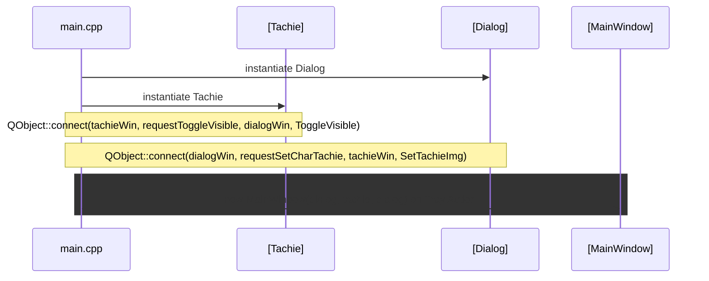
```mermaid
sequenceDiagram
    participant M as main.cpp
    participant T as [Tachie]
    participant D as [Dialog]
    participant S as [MainWindow]

    M->>D: instantiate Dialog
    M->>T: instantiate Tachie
    Note over M,T: QObject::connect(tachieWin, requestToggleVisible, dialogWin, ToggleVisible)
    Note over M,D: QObject::connect(dialogWin, requestSetCharTachie, tachieWin, SetTachieImg)
    
    rect secondary [Lazy Loading]
        M->>S: new MainWindow(dialog, tachie, dialog) on Tray Action
    end
```
**Sources:** [main.cpp:21-53](), [windows/dialog/dialog.h:1-10](), [windows/tachie/tachie.h:1-10]()

## Child Pages

For detailed technical documentation on specific areas of the codebase, please refer to the following pages:

*   **[Getting Started & Project Structure](#1.1)**: Covers environment setup, CMake configuration, and the directory layout of `3rdparty/`, `res/`, and `windows/`.
*   **[Application Lifecycle & Entry Point](#1.2)**: A deep dive into `main.cpp`, covering `QApplication` initialization, system tray setup via `ElaMenu`, and the lazy-loading pattern for the settings window.

---
**Sources:**
* [CMakeLists.txt:1-126]()
* [README.md:1-85]()
* [main.cpp:1-59]()
* [CONTRIBUTING.md:1-83]()

---

<<< SECTION: 1.1 Getting Started & Project Structure [1-1-getting-started-project-structure] >>>

# Getting Started & Project Structure

Relevant source files

The following files were used as context for generating this wiki page:

- [.gitignore](.gitignore)
- [CMakeLists.txt](CMakeLists.txt)
- [CONTRIBUTING.md](CONTRIBUTING.md)
- [LICENSE](LICENSE)
- [README.md](README.md)

This page provides a technical overview of the ZcChat2 development environment, the build system configuration, and the organizational structure of the source code and assets. ZcChat2 is developed using **C++17** and **Qt 6**, targeting Windows and Linux platforms with a focus on high-performance AI interactions and Galgame-style visual effects.

## Development Environment Setup

To contribute to or build ZcChat2, the following environment is required:

*   **Compiler**: MSVC 2019 64-bit (Windows) or GCC/Clang with C++17 support (Linux) [CONTRIBUTING.md:27-30]().
*   **Framework**: Qt 6.6.3 or higher [CONTRIBUTING.md:29-29]().
*   **Build System**: CMake 3.16+ [CMakeLists.txt:1-1]().
*   **Qt Modules**: The project requires the following specific Qt components:
    *   `Widgets` (Core UI)
    *   `Network` (LLM API and VITS requests)
    *   `Multimedia` (Audio playback for VITS)
    *   `Svg` (Icon rendering)
    *   `Gui` (Window management) [CMakeLists.txt:17-18, 76-82]().

### Linux Dependencies
On Linux systems, the build requires X11 development headers for mouse click-through functionality:
*   `X11` and `Xext` [CMakeLists.txt:96-96]().

## Build System Configuration

ZcChat2 uses CMake with `CMAKE_AUTOUIC`, `CMAKE_AUTOMOC`, and `CMAKE_AUTORCC` enabled to handle Qt's meta-object compiler, UI files, and resource system automatically [CMakeLists.txt:5-7]().

### Project Build Flow
The following diagram illustrates how the CMake configuration bridges the source files to the final executable.

**Diagram: Build System Entity Mapping**
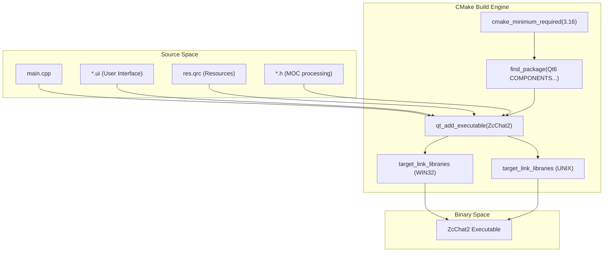
```mermaid
graph TD
    subgraph "Source Space"
        main["main.cpp"]
        ui_files["*.ui (User Interface)"]
        qrc["res.qrc (Resources)"]
        headers["*.h (MOC processing)"]
    end

    subgraph "CMake Build Engine"
        cm_init["cmake_minimum_required(3.16)"]
        qt_find["find_package(Qt6 COMPONENTS...)"]
        target["qt_add_executable(ZcChat2)"]
        link_win["target_link_libraries (WIN32)"]
        link_unix["target_link_libraries (UNIX)"]
    end

    subgraph "Binary Space"
        exe["ZcChat2 Executable"]
    end

    main --> target
    ui_files --> target
    qrc --> target
    headers --> target
    cm_init --> qt_find
    qt_find --> target
    target --> link_win
    target --> link_unix
    link_win --> exe
    link_unix --> exe
```
Sources: [CMakeLists.txt:1-44](), [CMakeLists.txt:85-114]()

## Project Directory Structure

The codebase follows a modular layout to separate UI logic, utilities, and third-party dependencies.

| Directory | Purpose | Key Contents |
| :--- | :--- | :--- |
| `3rdparty/` | External libraries | `ZcAILib`, `ZcJsonLib`, `ElaWidgetTools` |
| `res/` | Static resources | Icons, default character configurations |
| `utils/` | Helper classes | `DragHelper`, `CustomScrollBinder` |
| `windows/` | UI Modules | `dialog/`, `tachie/`, `setting/` |

### Detailed File Organization
*   **windows/dialog/**: Contains the main chat interface (`dialog.cpp`) and the conversation history subsystem (`history/`) [CMakeLists.txt:32-34]().
*   **windows/tachie/**: Manages the character overlay window and sprite rendering [CMakeLists.txt:38-38]().
*   **windows/setting/**: Contains the `ElaWindow`-based configuration interface and its specialized sub-pages for LLM, VITS, and Character management [CMakeLists.txt:23-25, 40-42]().
*   **3rdparty/**: Organized into `include/`, `lib/`, and `bin/` subdirectories for each library to ensure clean linkage [CONTRIBUTING.md:35-39]().

Sources: [CONTRIBUTING.md:32-49](), [CMakeLists.txt:21-43]()

## Configuration & Asset Layout

ZcChat2 distinguishes between **Global Config** (app-wide) and **Character Config** (asset-specific). It uses a dual-file system: `.ini` for machine-local state and `.json` for portable settings [CONTRIBUTING.md:53-54]().

### Character Directory Convention
Characters are stored in the `Character/` root, split into two functional areas:
1.  **Assets/**: Immutable or shared data (sprites, animations, base prompts).
2.  **UserConfig/**: Local user overrides (window positions, specific model selections) [CONTRIBUTING.md:59-68]().

**Diagram: Configuration and Asset Hierarchy**
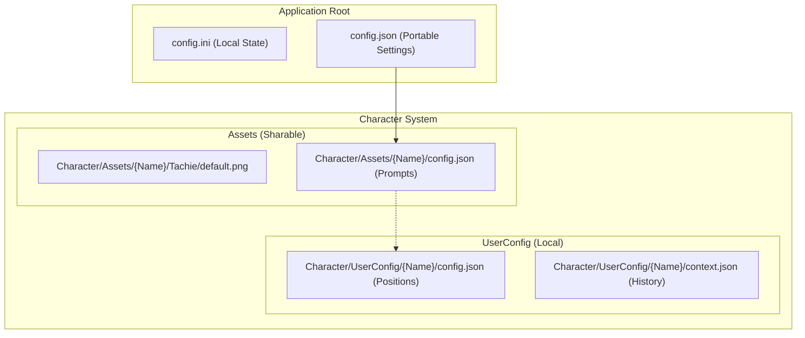
```mermaid
graph TD
    subgraph "Application Root"
        INI["config.ini (Local State)"]
        JSON["config.json (Portable Settings)"]
    end

    subgraph "Character System"
        direction TB
        subgraph "Assets (Sharable)"
            A_PNG["Character/Assets/{Name}/Tachie/default.png"]
            A_JSON["Character/Assets/{Name}/config.json (Prompts)"]
        end
        subgraph "UserConfig (Local)"
            U_JSON["Character/UserConfig/{Name}/config.json (Positions)"]
            U_HIST["Character/UserConfig/{Name}/context.json (History)"]
        end
    end

    JSON --> A_JSON
    A_JSON -.-> U_JSON
```
Sources: [CONTRIBUTING.md:55-68]()

## Third-Party Library Integration

The project integrates four primary internal/external libraries via `target_include_directories` and `target_link_libraries` [CMakeLists.txt:64-92]().

1.  **ZcAILib**: High-performance AI request library for LLM communication [README.md:82-82]().
2.  **ZcJsonLib**: QSettings-style JSON persistence for configuration files [README.md:84-84]().
3.  **ElaWidgetTools**: Fluent-UI component framework for the modern Windows look [README.md:81-81]().
4.  **ZcWidgetTools**: Extensions for ElaWidgetTools, including animated stacked widgets [README.md:83-83]().

### Linking Logic
*   **Windows**: Links against `.lib` files in `3rdparty/{libname}/lib/` [CMakeLists.txt:85-92]().
*   **Linux**: Links against `.a` static archives and sets `INSTALL_RPATH` to `$ORIGIN` for runtime dependency resolution [CMakeLists.txt:105-113]().

Sources: [CMakeLists.txt:64-114]()

---

<<< SECTION: 1.2 Application Lifecycle & Entry Point [1-2-application-lifecycle-entry-point] >>>

# Application Lifecycle & Entry Point

Relevant source files

The following files were used as context for generating this wiki page:

- [main.cpp](main.cpp)
- [windows/setting/setting.cpp](windows/setting/setting.cpp)
- [windows/setting/setting.h](windows/setting/setting.h)

This page provides a technical walkthrough of the ZcChat2 application lifecycle, focusing on the `main.cpp` entry point, the initialization of core window components, and the signal-slot orchestration that governs the application's runtime behavior.

## Application Initialization

The application entry point is located in `main.cpp`. It initializes the `QApplication` event loop and configures basic metadata used by the Qt framework for persistent storage and logging.

| Step | Action | Code Entity |
| :--- | :--- | :--- |
| 1 | Create Application Instance | `QApplication a(argc, argv)` |
| 2 | Set Metadata | `setApplicationName`, `setOrganizationName` |
| 3 | Window Instantiation | `Dialog dialogWin`, `Tachie tachieWin` |
| 4 | Signal Wiring | `QObject::connect` |
| 5 | System Tray Setup | `QSystemTrayIcon tray` |
| 6 | Execute Event Loop | `a.exec()` |

### Entry Point Logic Flow
The following diagram illustrates the transition from the OS entry point to the active state of the two primary windows.

**Diagram: Startup and Window Instantiation Flow**
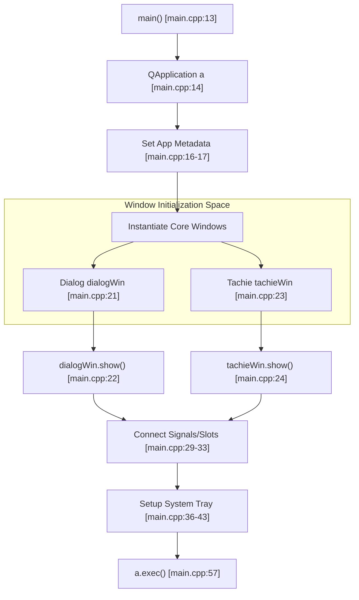
```mermaid
graph TD
    START["main() [main.cpp:13]"] --> QAPP["QApplication a [main.cpp:14]"]
    QAPP --> META["Set App Metadata [main.cpp:16-17]"]
    META --> WIN_INIT["Instantiate Core Windows"]
    
    subgraph "Window Initialization Space"
        WIN_INIT --> DIALOG["Dialog dialogWin [main.cpp:21]"]
        WIN_INIT --> TACHIE["Tachie tachieWin [main.cpp:23]"]
    end
    
    DIALOG --> SHOW_D["dialogWin.show() [main.cpp:22]"]
    TACHIE --> SHOW_T["tachieWin.show() [main.cpp:24]"]
    
    SHOW_D --> WIRING["Connect Signals/Slots [main.cpp:29-33]"]
    SHOW_T --> WIRING
    
    WIRING --> TRAY["Setup System Tray [main.cpp:36-43]"]
    TRAY --> EXEC["a.exec() [main.cpp:57]"]
```
**Sources:** [main.cpp:13-57]()

## Signal-Slot Wiring

Communication between the decoupled window components is established in `main.cpp` immediately after instantiation. This allows the `Tachie` (character overlay) and `Dialog` (chat interface) to interact without direct dependency on each other's private internals.

### Core Connections in main.cpp
1.  **Visibility Toggling**: `Tachie::requestToggleVisible` is connected to `Dialog::ToggleVisible`. This allows the user to click or interact with the desktop pet to show/hide the chat interface [main.cpp:29-30]().
2.  **Tachie Image Updates**: `Dialog::requestSetCharTachie` is connected to `Tachie::SetTachieImg`. This enables the AI's response (which may contain mood tags) to trigger a change in the character's displayed sprite [main.cpp:32-33]().

### Extended Connections in MainWindow (Settings)
When the `MainWindow` (Settings) is initialized, it establishes further connections to propagate user configuration changes to the active windows:
*   **Character Reload**: `SettingChild_Char::requestReloadCharSelect` calls `Tachie::SetTachieImg` [windows/setting/setting.cpp:27-28]().
*   **Scaling**: `SettingChild_Char::requestSetTachieSize` calls `Tachie::SetTachieSize` [windows/setting/setting.cpp:29-30]().
*   **Positioning**: `SettingChild_Char::requestResetTachieLoc` calls `Tachie::ResetTachieLoc` [windows/setting/setting.cpp:31-32]().
*   **AI Context**: `SettingChild_Char::requestReloadAIConfig` calls `Dialog::ReloadAIConfig` [windows/setting/setting.cpp:33-34]().

**Sources:** [main.cpp:29-33](), [windows/setting/setting.cpp:27-35]()

## System Tray & Lazy Loading

The application utilizes a `QSystemTrayIcon` to provide a persistent background presence. To optimize startup performance and memory footprint, the `MainWindow` (Settings window) is implemented using a **Lazy Loading** pattern.

### Tray Configuration
The tray menu is built using `ElaMenu`, a Fluent-UI styled component from the `ElaWidgetTools` library.
*   **Icon**: Set via `:/res/img/logo/logo.png` [main.cpp:37]().
*   **Menu Actions**: Contains "设置" (Settings) and "退出" (Quit) [main.cpp:40-41]().

### Lazy Loading Implementation
The `MainWindow` pointer is initially set to `nullptr` [main.cpp:25](). It is only instantiated when the user triggers the "Settings" action from the tray.

**Diagram: Settings Window Lazy Loading Logic**
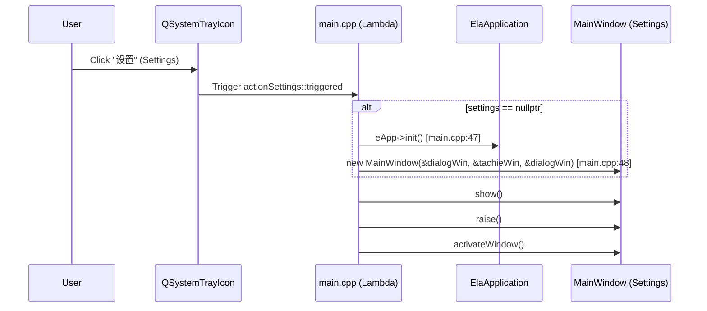
```mermaid
sequenceDiagram
    participant U as User
    participant T as QSystemTrayIcon
    participant M as main.cpp (Lambda)
    participant E as ElaApplication
    participant S as MainWindow (Settings)

    U->>T: Click "设置" (Settings)
    T->>M: Trigger actionSettings::triggered
    alt settings == nullptr
        M->>E: eApp->init() [main.cpp:47]
        M->>S: new MainWindow(&dialogWin, &tachieWin, &dialogWin) [main.cpp:48]
    end
    M->>S: show()
    M->>S: raise()
    M->>S: activateWindow()
```

**Sources:** [main.cpp:25-53]()

## Shutdown Path

The application shutdown is managed through the `QApplication::quit` slot. This is triggered via the "退出" (Quit) action in the system tray menu [main.cpp:55]().

1.  **Trigger**: `actionQuit` signal `triggered` is emitted.
2.  **Execution**: `QApplication::quit()` is called, which breaks the `a.exec()` event loop.
3.  **Cleanup**: Local stack objects (`dialogWin`, `tachieWin`, `tray`) are destroyed automatically as the `main()` function exits. If the `settings` window was instantiated on the heap, its ownership is managed by the parent passed during construction (in this case, `dialogWin`) [main.cpp:48](), or it is cleaned up by the OS upon process termination.

**Sources:** [main.cpp:48-57]()

---

<<< SECTION: 2 Core Architecture [2-core-architecture] >>>

# Core Architecture

Relevant source files

The following files were used as context for generating this wiki page:

- [CMakeLists.txt](CMakeLists.txt)
- [GlobalConstants.h](GlobalConstants.h)
- [main.cpp](main.cpp)

The ZcChat2 architecture is built upon a multi-window, signal-driven design that separates the character's visual representation (`Tachie`) from the interaction logic (`Dialog`). The system relies on a decentralized configuration model and a robust path resolution engine to manage character assets and user settings across different platforms.

## Multi-Window Communication Graph

The application lifecycle begins in `main.cpp`, where the `Dialog` and `Tachie` windows are instantiated and cross-linked via Qt's signal-slot mechanism. A third window, `MainWindow` (Settings), is lazy-loaded via the system tray to conserve resources.

### Signal-Slot Topology
The following diagram illustrates how the core entities communicate to synchronize visibility and character states.

**Diagram: Window Interaction Flow**
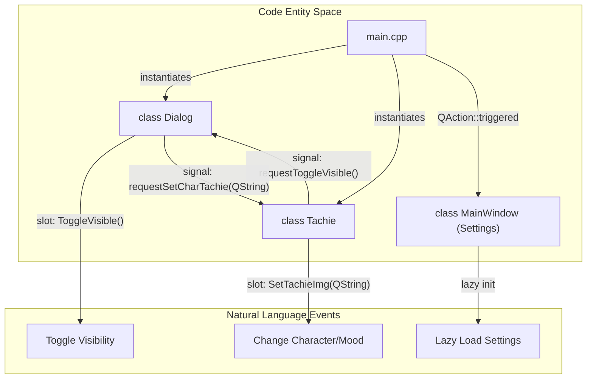
```mermaid
graph TD
    subgraph "Code Entity Space"
        MAIN["main.cpp"]
        DIAL["class Dialog"]
        TACH["class Tachie"]
        SETT["class MainWindow (Settings)"]
    end

    subgraph "Natural Language Events"
        EV_TOGGLE["Toggle Visibility"]
        EV_CHANGE["Change Character/Mood"]
        EV_LOAD["Lazy Load Settings"]
    end

    MAIN -- "instantiates" --> DIAL
    MAIN -- "instantiates" --> TACH
    
    TACH -- "signal: requestToggleVisible()" --> DIAL
    DIAL -- "slot: ToggleVisible()" --> EV_TOGGLE
    
    DIAL -- "signal: requestSetCharTachie(QString)" --> TACH
    TACH -- "slot: SetTachieImg(QString)" --> EV_CHANGE
    
    MAIN -- "QAction::triggered" --> SETT
    SETT -- "lazy init" --> EV_LOAD
```
Sources: [main.cpp:21-53](), [windows/dialog/dialog.h:1-20](), [windows/tachie/tachie.h:1-20]()

## Dual-Config & Path Resolution Engine

ZcChat2 employs a "Dual-Config" system defined in `GlobalConstants.h` to distinguish between machine-local state and portable user preferences.

| Config Type | File Format | Path Variable | Purpose |
| :--- | :--- | :--- | :--- |
| **State Config** | `.ini` | `IniSettingPath` | Local window positions, last selected character. |
| **Global Config** | `.json` | `JsonSettingPath` | API keys, LLM provider settings, global VITS URLs. |
| **Character Config** | `.json` | `ReadCharacterUserConfigPath()` | Per-character prompt, voice selection, and scaling. |

### Path Resolution Logic
The `GlobalConstants.h` file acts as the central engine for resolving filesystem paths. It uses `QStandardPaths::DocumentsLocation` to ensure cross-platform compatibility (Windows/Linux).

*   **`ReadNowSelectChar()`**: Retrieves the currently active character name from the INI file [GlobalConstants.h:28-33]().
*   **`ReadCharacterTachiePath()`**: Constructs the absolute path to the character's sprite directory [GlobalConstants.h:36-45]().
*   **`ReadCharacterUserConfigPath()`**: Locates the specific JSON configuration for the active character [GlobalConstants.h:48-54]().

For details, see [Configuration & Path Management](#2.1).

Sources: [GlobalConstants.h:8-62]()

## Subsystem Architecture

The codebase is organized into specialized subsystems, each handled by specific classes and third-party integrations.

### Core Components
*   **Tachie (Overlay)**: A frameless, mouse-transparent window that renders character sprites. It uses `DragHelper` for movement and platform-specific masking for click-through behavior.
*   **Dialog (Interaction)**: The primary logic hub. It handles LLM requests via `ZcAILib`, manages VITS audio playback, and synchronizes the conversation history window.
*   **Settings (Management)**: An `ElaWindow`-based interface that allows real-time modification of AI providers and character assets.

**Diagram: System Component Mapping**
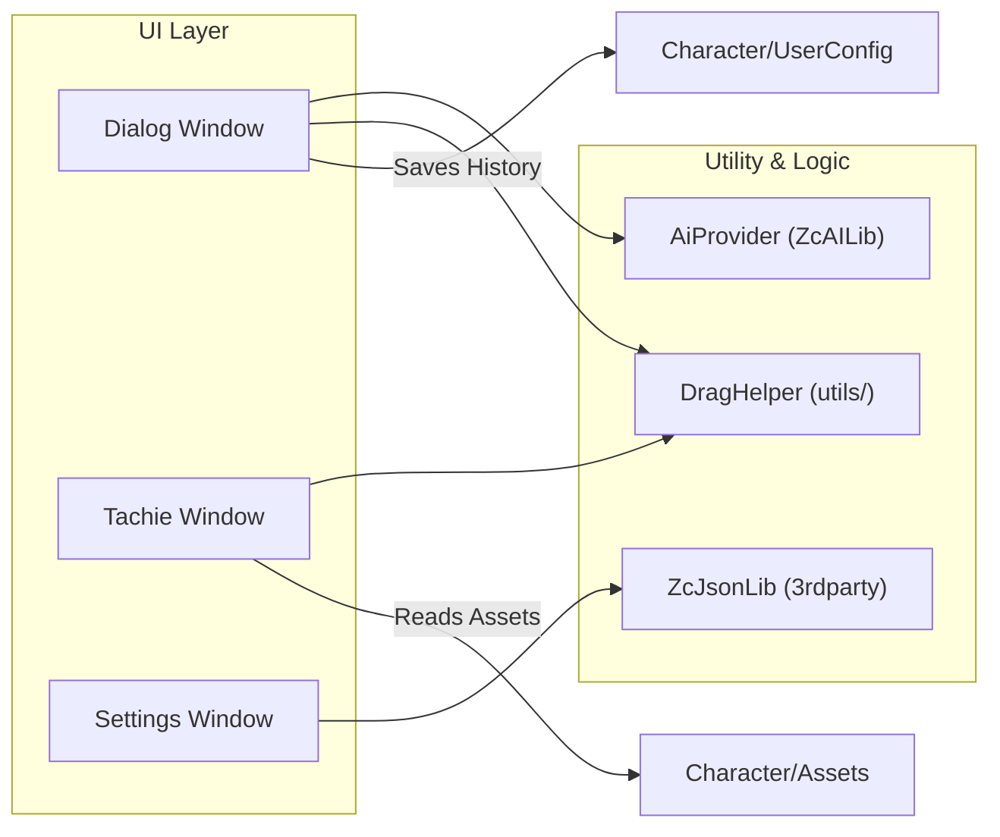
```mermaid
graph LR
    subgraph "UI Layer"
        D[Dialog Window]
        T[Tachie Window]
        S[Settings Window]
    end

    subgraph "Utility & Logic"
        DH["DragHelper (utils/)"]
        AI["AiProvider (ZcAILib)"]
        JSON["ZcJsonLib (3rdparty)"]
    end

    D --> AI
    D & T --> DH
    S --> JSON
    T -- "Reads Assets" --> CP["Character/Assets"]
    D -- "Saves History" --> CU["Character/UserConfig"]
```

### Third-Party Integration
The project integrates four key libraries to extend functionality:
1.  **ZcAILib**: Provides the `AiProvider` API for streaming LLM communication [CMakeLists.txt:68]().
2.  **ZcJsonLib**: A persistence layer for JSON-based settings [CMakeLists.txt:69]().
3.  **ZcWidgetTools**: Provides `ZcStackedWidget` for animated UI transitions [CMakeLists.txt:70]().
4.  **ElaWidgetTools**: A Fluent-UI framework for the modern Settings interface [CMakeLists.txt:71]().

For details, see [Third-Party Libraries](#2.2).

Sources: [CMakeLists.txt:64-92](), [main.cpp:45-53]()

## UI Utilities

To support the frameless window design, the project utilizes two primary helper classes located in `utils/`:
*   **`DragHelper`**: An event filter that enables dragging on frameless windows by intercepting mouse events [CMakeLists.txt:39]().
*   **`CustomScrollBinder`**: Synchronizes standard `QTextEdit` scrolling with custom-styled `QScrollBar` widgets [CMakeLists.txt:37]().

For details, see [UI Utilities](#2.3).

Sources: [CMakeLists.txt:37-39]()

---

<<< SECTION: 2.1 Configuration & Path Management [2-1-configuration-path-management] >>>

# Configuration & Path Management

Relevant source files

The following files were used as context for generating this wiki page:

- [GlobalConstants.h](GlobalConstants.h)
- [res/default_config/ZcChat2/Character/Assets/test/config.json](res/default_config/ZcChat2/Character/Assets/test/config.json)
- [res/default_config/ZcChat2/Character/UserConfig/test/config.json](res/default_config/ZcChat2/Character/UserConfig/test/config.json)
- [res/default_config/ZcChat2/config.ini](res/default_config/ZcChat2/config.ini)

ZcChat2 utilizes a specialized dual-format configuration system and a hierarchical path resolution engine to manage application state, user preferences, and character assets. This architecture separates machine-local state (INI) from portable, data-rich settings (JSON), while maintaining a strict distinction between immutable character assets and mutable user configurations.

## Dual-Format Configuration System

The system splits configuration into two distinct files located in the user's documents directory. This separation allows for different persistence strategies based on the nature of the data.

| File | Format | Code Identifier | Purpose |
| :--- | :--- | :--- | :--- |
| `config.ini` | INI | `IniSettingPath` | Stores machine-local, non-portable state such as the currently selected character. |
| `config.json` | JSON | `JsonSettingPath` | Stores portable settings, API keys, and complex nested structures managed by `ZcJsonLib`. |

### Path Resolution Entities
The following diagram illustrates how `GlobalConstants.h` maps physical file locations to code entities.

**Configuration Path Mapping**
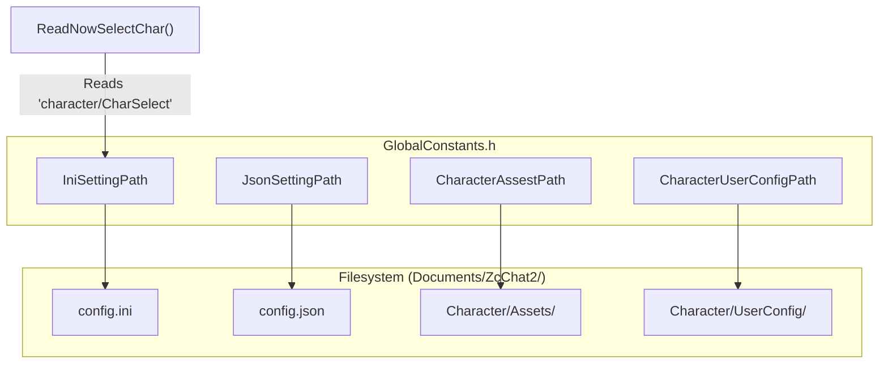
```mermaid
graph TD
    subgraph "Filesystem (Documents/ZcChat2/)"
        INI_F["config.ini"]
        JSON_F["config.json"]
        ASSETS_D["Character/Assets/"]
        UCONFIG_D["Character/UserConfig/"]
    end

    subgraph "GlobalConstants.h"
        direction LR
        ISP["IniSettingPath"] --> INI_F
        JSP["JsonSettingPath"] --> JSON_F
        CAP["CharacterAssestPath"] --> ASSETS_D
        CUCP["CharacterUserConfigPath"] --> UCONFIG_D
    end

    RN["ReadNowSelectChar()"] -- "Reads 'character/CharSelect'" --> ISP
```
**Sources:** [GlobalConstants.h:8-25](), [res/default_config/ZcChat2/config.ini:1-3]()

## Character Directory Structure

ZcChat2 enforces a strict separation between **Assets** (provided by character creators) and **UserConfig** (generated/modified by the user). This ensures that updating a character's artwork or default prompt does not overwrite user-specific settings like window scaling or conversation history.

### 1. Character Assets (`Character/Assets`)
Contains immutable data required to define the character.
*   **Tachie/**: Directory containing sprite images (PNG/JPG).
*   **config.json**: Contains the character's base `prompt` used for LLM personality.

### 2. Character UserConfig (`Character/UserConfig`)
Contains mutable data specific to the user's interaction with that character.
*   **config.json**: Stores user preferences like `tachieSize`, `vitsEnable`, and model selections.
*   **context.json**: Stores the persistent conversation history for the AI.

**Sources:** [GlobalConstants.h:17-25](), [res/default_config/ZcChat2/Character/Assets/test/config.json:1-4](), [res/default_config/ZcChat2/Character/UserConfig/test/config.json:1-4]()

## Path Resolution Functions

`GlobalConstants.h` provides a suite of inline functions to resolve paths dynamically based on the currently selected character. These functions act as the primary API for the `Tachie` and `Dialog` windows to access resources.

### Functional Logic Flow
The following diagram shows the dependency chain when the system attempts to resolve a character-specific resource.

**Resource Resolution Pipeline**
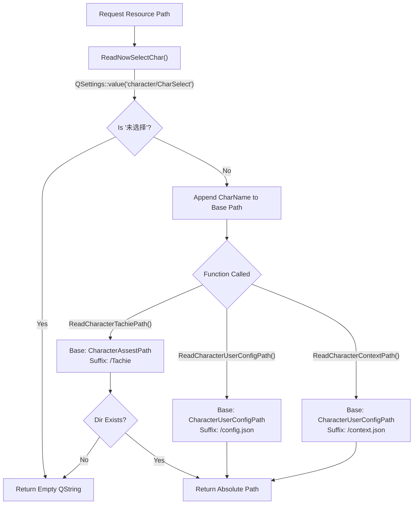
```mermaid
flowchart TD
    Start["Request Resource Path"] --> Select["ReadNowSelectChar()"]
    Select -- "QSettings::value('character/CharSelect')" --> CheckSelect{"Is '未选择'?"}
    
    CheckSelect -- "Yes" --> ReturnEmpty["Return Empty QString"]
    CheckSelect -- "No" --> BuildPath["Append CharName to Base Path"]
    
    BuildPath --> Type{Function Called}
    
    Type -- "ReadCharacterTachiePath()" --> Tachie["Base: CharacterAssestPath<br/>Suffix: /Tachie"]
    Type -- "ReadCharacterUserConfigPath()" --> UConfig["Base: CharacterUserConfigPath<br/>Suffix: /config.json"]
    Type -- "ReadCharacterContextPath()" --> Context["Base: CharacterUserConfigPath<br/>Suffix: /context.json"]

    Tachie --> Exist{"Dir Exists?"}
    Exist -- "No" --> ReturnEmpty
    Exist -- "Yes" --> ReturnPath["Return Absolute Path"]
    UConfig --> ReturnPath
    Context --> ReturnPath
```

### Key Implementation Details
*   **`ReadNowSelectChar()`**: Uses `QSettings` to read from `IniSettingPath`. It defaults to `"未选择"` (Not Selected) if the key is missing. [GlobalConstants.h:28-33]()
*   **`ReadCharacterTachiePath()`**: Resolves the directory containing character sprites. It performs a safety check using `QDir::exists()` before returning the path. [GlobalConstants.h:36-45]()
*   **`ReadCharacterUserConfigPath()`**: Returns the path to the user-specific JSON configuration for the active character. [GlobalConstants.h:48-54]()
*   **`ReadCharacterContextPath()`**: Returns the path to the `context.json` file where the conversation history is stored. [GlobalConstants.h:57-62]()

**Sources:** [GlobalConstants.h:27-63]()

## Default Templates

The project includes a `res/default_config/` directory which serves as the template for the initial application setup. When the application runs for the first time, or when a new character is imported, it follows the structure defined here:

| Template Path | Initial Content |
| :--- | :--- |
| `ZcChat2/config.ini` | Sets `CharSelect=test` [res/default_config/ZcChat2/config.ini:1-3]() |
| `Character/Assets/test/config.json` | Empty `prompt` string [res/default_config/ZcChat2/Character/Assets/test/config.json:1-4]() |
| `Character/UserConfig/test/config.json` | Default `tachieSize` of "100" [res/default_config/ZcChat2/Character/UserConfig/test/config.json:1-4]() |

**Sources:** [res/default_config/ZcChat2/config.ini:1-3](), [res/default_config/ZcChat2/Character/Assets/test/config.json:1-4](), [res/default_config/ZcChat2/Character/UserConfig/test/config.json:1-4]()

---

<<< SECTION: 2.2 Third-Party Libraries [2-2-third-party-libraries] >>>

# Third-Party Libraries

Relevant source files

The following files were used as context for generating this wiki page:

- [3rdparty/ElaWidgetTools/bin/elawidgettools.dll](3rdparty/ElaWidgetTools/bin/elawidgettools.dll)
- [3rdparty/ElaWidgetTools/lib/libElaWidgetTools.a](3rdparty/ElaWidgetTools/lib/libElaWidgetTools.a)
- [3rdparty/ZcAILib/bin/ZcAiLib.dll](3rdparty/ZcAILib/bin/ZcAiLib.dll)
- [3rdparty/ZcAILib/include/AiProvider.h](3rdparty/ZcAILib/include/AiProvider.h)
- [3rdparty/ZcAILib/lib/ZcAiLib.lib](3rdparty/ZcAILib/lib/ZcAiLib.lib)
- [3rdparty/ZcJsonLib/bin/ZcJsonLib.dll](3rdparty/ZcJsonLib/bin/ZcJsonLib.dll)
- [3rdparty/ZcJsonLib/include/ZcJsonLib.h](3rdparty/ZcJsonLib/include/ZcJsonLib.h)
- [3rdparty/ZcJsonLib/include/ZcJsonLib_global.h](3rdparty/ZcJsonLib/include/ZcJsonLib_global.h)
- [3rdparty/ZcJsonLib/lib/ZcJsonLib.lib](3rdparty/ZcJsonLib/lib/ZcJsonLib.lib)
- [3rdparty/ZcWidgetTools/bin/ZcWidgetTools.dll](3rdparty/ZcWidgetTools/bin/ZcWidgetTools.dll)
- [3rdparty/ZcWidgetTools/include/ZcStackedWidget.h](3rdparty/ZcWidgetTools/include/ZcStackedWidget.h)
- [3rdparty/ZcWidgetTools/lib/libZcWidgetTools.a](3rdparty/ZcWidgetTools/lib/libZcWidgetTools.a)

The ZcChat2 project relies on four primary third-party libraries located in the `3rdparty/` directory. These libraries provide the foundational capabilities for LLM communication, configuration management, and the Fluent-UI inspired visual interface. This page serves as a high-level catalog of these dependencies and their integration points.

## Library Overview

The following table summarizes the bundled libraries and their roles within the system:

| Library | Purpose | Primary Artifacts |
| :--- | :--- | :--- |
| **ZcAILib** | LLM API communication (OpenAI/DeepSeek) | `ZcAiLib.dll`, `ZcAiLib.lib` |
| **ZcJsonLib** | QSettings-style JSON persistence | `ZcJsonLib.dll`, `ZcJsonLib.lib` |
| **ZcWidgetTools** | Animated UI components (Stacked Widgets) | `ZcWidgetTools.dll`, `libZcWidgetTools.a` |
| **ElaWidgetTools** | Fluent-UI framework for the Settings window | `elawidgettools.dll`, `libElaWidgetTools.a` |

### System Dependency Graph

The diagram below illustrates how the core application windows consume these third-party libraries to perform their specialized tasks.

**Library Consumption Flow**
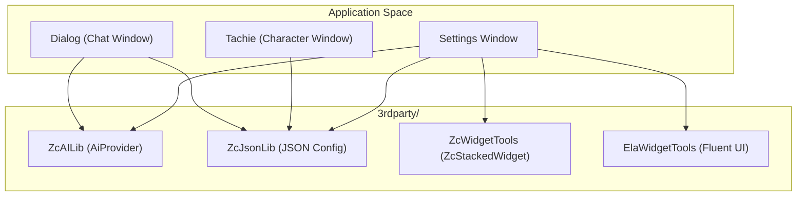
```mermaid
graph TD
    subgraph "Application Space"
        Dialog["Dialog (Chat Window)"]
        Tachie["Tachie (Character Window)"]
        Settings["Settings Window"]
    end

    subgraph "3rdparty/"
        ZcAILib["ZcAILib (AiProvider)"]
        ZcJsonLib["ZcJsonLib (JSON Config)"]
        ZcWT["ZcWidgetTools (ZcStackedWidget)"]
        ElaWT["ElaWidgetTools (Fluent UI)"]
    end

    Dialog --> ZcAILib
    Dialog --> ZcJsonLib
    Tachie --> ZcJsonLib
    Settings --> ZcWT
    Settings --> ElaWT
    Settings --> ZcAILib
    Settings --> ZcJsonLib
```
Sources: [3rdparty/ZcAILib/include/AiProvider.h:12-13](), [3rdparty/ZcJsonLib/include/ZcJsonLib.h:9-10](), [3rdparty/ZcWidgetTools/include/ZcStackedWidget.h:10-11]()

---

## Bundled Libraries

### ZcAILib — LLM Communication
`ZcAILib` provides the `AiProvider` class, which abstracts the complexity of network requests to Large Language Model providers. It supports streaming chat responses and model list retrieval.

*   **Key Class:** `AiProvider` [3rdparty/ZcAILib/include/AiProvider.h:12-13]()
*   **Capabilities:** Supports `OpenAI`, `DeepSeek`, and `Custom` service types [3rdparty/ZcAILib/include/AiProvider.h:17-21]().
*   **Primary Methods:** `chat(QString)` for sending messages and `fetchModels()` for updating available model lists [3rdparty/ZcAILib/include/AiProvider.h:43-46]().

For details, see [ZcAILib — AiProvider API](#2.2.1).

### ZcJsonLib — Configuration Persistence
`ZcJsonLib` is a lightweight wrapper around Qt's JSON classes, designed to mimic the `QSettings` API for easy reading and writing of configuration files using dot-separated keys (e.g., `llm.OpenAI.ApiKey`).

*   **Key Class:** `ZcJsonLib` [3rdparty/ZcJsonLib/include/ZcJsonLib.h:9-10]()
*   **Capabilities:** Recursive JSON object navigation via `setValue()` and `value()` [3rdparty/ZcJsonLib/include/ZcJsonLib.h:17-19]().
*   **Lifecycle:** Managed through `load()` and `save()` calls to sync with the filesystem [3rdparty/ZcJsonLib/include/ZcJsonLib.h:14-15]().

For details, see [ZcJsonLib — JSON Configuration Library](#2.2.2).

### ZcWidgetTools — Animated Transitions
This library provides specialized widgets that enhance the visual fluidity of the application. Its primary export is the `ZcStackedWidget`, which adds slide animations to standard page switching.

*   **Key Class:** `ZcStackedWidget` [3rdparty/ZcWidgetTools/include/ZcStackedWidget.h:10-11]()
*   **Functionality:** Overrides standard index switching with `QPropertyAnimation` and `QEasingCurve` transitions [3rdparty/ZcWidgetTools/include/ZcStackedWidget.h:17-24]().

### ElaWidgetTools — UI Framework
`ElaWidgetTools` is an extensive Fluent-UI widget library used primarily to construct the `Settings` window. It provides the high-level window structure, navigation sidebars, and custom controls like breadcrumbs and toggle switches.

*   **Artifacts:** Linked as a static library (`libElaWidgetTools.a`) with a runtime DLL (`elawidgettools.dll`).
*   **Usage:** Used in the `Settings` window to provide a modern, searchable configuration interface.

---

## CMake Integration

The libraries are integrated into the build system via the top-level `CMakeLists.txt`. The process involves specifying include directories and linking the appropriate import libraries.

**Code Entity Mapping: Library Linkage**
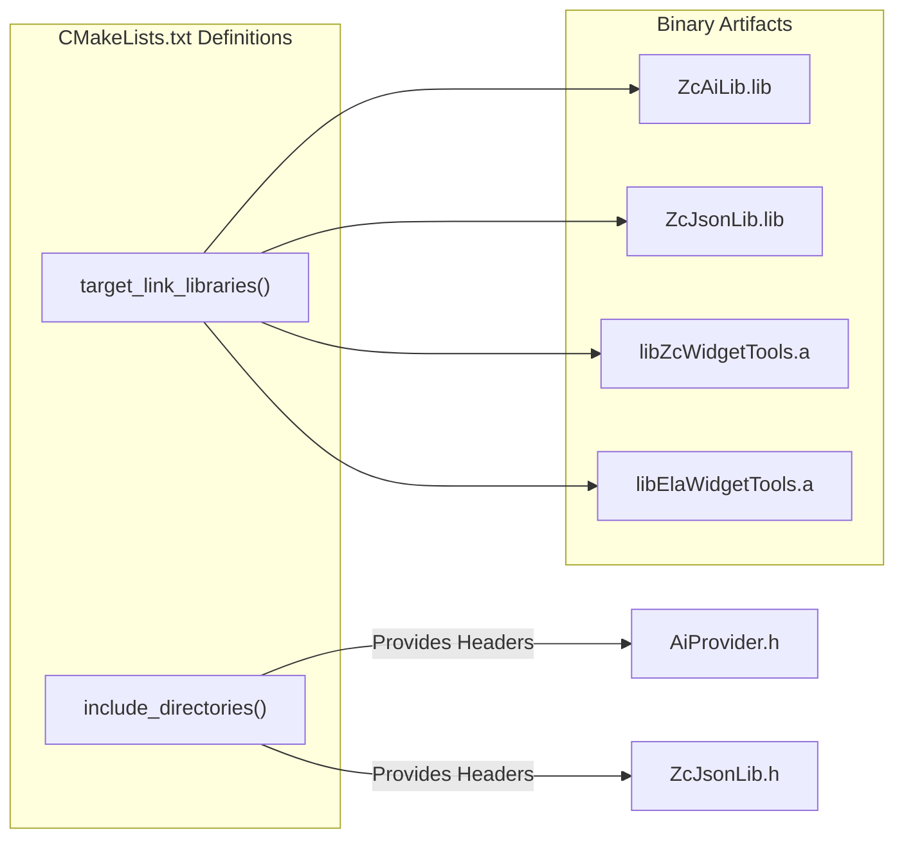
```mermaid
graph LR
    subgraph "CMakeLists.txt Definitions"
        INC["include_directories()"]
        LINK["target_link_libraries()"]
    end

    subgraph "Binary Artifacts"
        ZCAI_LIB["ZcAiLib.lib"]
        ZCJ_LIB["ZcJsonLib.lib"]
        ZCW_LIB["libZcWidgetTools.a"]
        ELA_LIB["libElaWidgetTools.a"]
    end

    INC -->|Provides Headers| AIP["AiProvider.h"]
    INC -->|Provides Headers| ZCJ["ZcJsonLib.h"]
    
    LINK --> ZCAI_LIB
    LINK --> ZCJ_LIB
    LINK --> ZCW_LIB
    LINK --> ELA_LIB
```

### Export Macros
Each library uses a global header (e.g., `ZcAiLib_global.h`, `ZcJsonLib_global.h`) to define export/import macros. This ensures that symbols are correctly exported when building the library and imported when consumed by the main application executable.

*   **Example:** `ZCJSONLIB_EXPORT` evaluates to `Q_DECL_EXPORT` during the library build and `Q_DECL_IMPORT` during application compilation [3rdparty/ZcJsonLib/include/ZcJsonLib_global.h:6-10]().

Sources: [3rdparty/ZcAILib/include/AiProvider.h:4-12](), [3rdparty/ZcJsonLib/include/ZcJsonLib_global.h:1-12](), [3rdparty/ZcWidgetTools/include/ZcStackedWidget.h:4-10]()

---

<<< SECTION: 2.2.1 ZcAILib — AiProvider API [2-2-1-zcailib-aiprovider-api] >>>

# ZcAILib — AiProvider API

Relevant source files

The following files were used as context for generating this wiki page:

- [3rdparty/ZcAILib/include/AiProvider.h](3rdparty/ZcAILib/include/AiProvider.h)
- [3rdparty/ZcAILib/lib/ZcAiLib.lib](3rdparty/ZcAILib/lib/ZcAiLib.lib)
- [3rdparty/ZcAILib/lib/libZcAiLib.a](3rdparty/ZcAILib/lib/libZcAiLib.a)
- [3rdparty/ZcJsonLib/include/ZcJsonLib.h](3rdparty/ZcJsonLib/include/ZcJsonLib.h)
- [3rdparty/ZcWidgetTools/include/ZcStackedWidget.h](3rdparty/ZcWidgetTools/include/ZcStackedWidget.h)

The `ZcAILib` is a core utility library providing a standardized interface for communicating with Large Language Model (LLM) providers. It abstracts the networking and protocol differences between services like OpenAI and DeepSeek, offering a unified signal-based API for streaming chat responses and model management.

## 1. Core Architecture

The primary entity in this library is the `AiProvider` class. It inherits from `QObject` to utilize Qt's signal-slot mechanism for asynchronous network communication.

### Data Structures and Enums
*   **`ServiceType`**: An enumeration defining the supported backends: `OpenAI`, `DeepSeek`, and `Custom` [3rdparty/ZcAILib/include/AiProvider.h:17-21]().
*   **`ModelInfo`**: A struct containing metadata for LLM models, including `id`, `created` timestamp, `ownedBy` string, and a `permissions` list [3rdparty/ZcAILib/include/AiProvider.h:24-29]().

### Component Relationship Diagram
This diagram illustrates how the `AiProvider` class bridges the application logic (Dialog/Settings) to the external LLM Network Space.

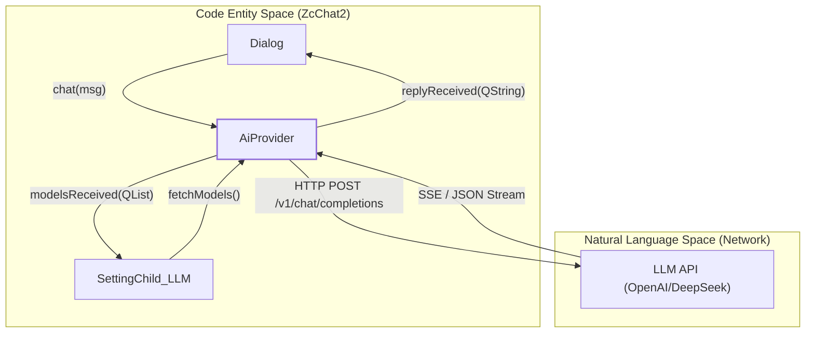
```mermaid
graph TD
    subgraph "Code Entity Space (ZcChat2)"
        D["Dialog"] -- "chat(msg)" --> AP["AiProvider"]
        S["SettingChild_LLM"] -- "fetchModels()" --> AP
        AP -- "replyReceived(QString)" --> D
        AP -- "modelsReceived(QList)" --> S
    end

    subgraph "Natural Language Space (Network)"
        AP -- "HTTP POST /v1/chat/completions" --> API["LLM API (OpenAI/DeepSeek)"]
        API -- "SSE / JSON Stream" --> AP
    end

    style AP stroke-width:2px
```
Sources: [3rdparty/ZcAILib/include/AiProvider.h:12-68](), [3rdparty/ZcAILib/lib/ZcAiLib.lib:3-3]()

## 2. API Reference

### Configuration Methods
The provider must be configured with credentials and endpoints before use. These methods update internal state but do not trigger network requests.

| Method | Description |
| :--- | :--- |
| `setServiceType(ServiceType type)` | Sets the backend protocol (OpenAI, DeepSeek, or Custom) [3rdparty/ZcAILib/include/AiProvider.h:34](). |
| `setApiKey(const QString &apiKey)` | Sets the `Authorization` bearer token [3rdparty/ZcAILib/include/AiProvider.h:35](). |
| `setApiUrl(const QString &url)` | Sets the base URL for the API provider [3rdparty/ZcAILib/include/AiProvider.h:36](). |
| `setModel(const QString &model)` | Sets the specific model ID (e.g., `gpt-4o` or `deepseek-chat`) [3rdparty/ZcAILib/include/AiProvider.h:37](). |
| `setSystemPrompt(const QString &prompt)` | Configures the `system` role message for the conversation context [3rdparty/ZcAILib/include/AiProvider.h:48](). |

### Operational Methods
These methods initiate asynchronous network operations using `QNetworkAccessManager` [3rdparty/ZcAILib/include/AiProvider.h:62]().

*   **`chat(const QString &message)`**: Sends a user message to the configured LLM. The request includes the system prompt and the user input. The response is handled asynchronously via `handleReply()` [3rdparty/ZcAILib/include/AiProvider.h:46,58]().
*   **`fetchModels()`**: Requests the list of available models from the provider's `/models` endpoint. Results are processed by `handleModelsReply()` [3rdparty/ZcAILib/include/AiProvider.h:43,59]().

### Signals
The library communicates results back to the consumer through three primary signals:

*   **`replyReceived(const QString &reply)`**: Emitted when a chunk of text or a full response is successfully parsed from the LLM [3rdparty/ZcAILib/include/AiProvider.h:53]().
*   **`errorOccurred(const QString &error)`**: Emitted when a network error, timeout, or API error (e.g., invalid API key) occurs [3rdparty/ZcAILib/include/AiProvider.h:54]().
*   **`modelsReceived(const QList<ModelInfo> &models)`**: Emitted after a successful `fetchModels()` call, providing a list of `ModelInfo` objects [3rdparty/ZcAILib/include/AiProvider.h:55]().

Sources: [3rdparty/ZcAILib/include/AiProvider.h:31-68](), [3rdparty/ZcAILib/lib/ZcAiLib.lib:3-3]()

## 3. Data Flow and Consumption

### Chat Interaction Flow (Dialog)
The `Dialog` window uses `AiProvider` to facilitate the core "Desktop Pet" interaction.

1.  **Initialization**: `Dialog` creates an instance of `AiProvider`.
2.  **Trigger**: User presses `Enter` in the input box.
3.  **Context Construction**: `Dialog` scans character assets for valid "moods" and builds a system prompt.
4.  **Request**: `Dialog` calls `AiProvider::chat()`.
5.  **Response**: `AiProvider` emits `replyReceived()`. `Dialog` parses the response (splitting by `|` for mood/text) and updates the UI.

### Model Configuration Flow (SettingChild_LLM)
The `SettingChild_LLM` page manages provider-specific settings.

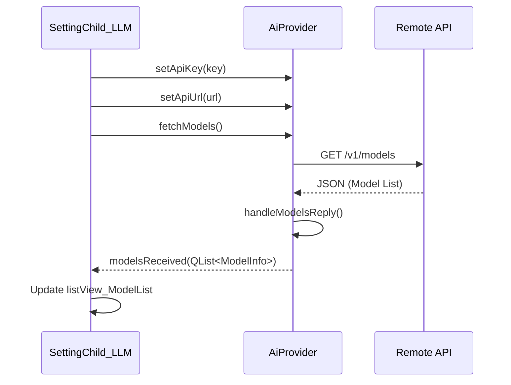
```mermaid
sequenceDiagram
    participant S as SettingChild_LLM
    participant AP as AiProvider
    participant NET as Remote API

    S->>AP: setApiKey(key)
    S->>AP: setApiUrl(url)
    S->>AP: fetchModels()
    AP->>NET: GET /v1/models
    NET-->>AP: JSON (Model List)
    AP->>AP: handleModelsReply()
    AP-->>S: modelsReceived(QList<ModelInfo>)
    S->>S: Update listView_ModelList
```

Sources: [3rdparty/ZcAILib/include/AiProvider.h:43-59](), [3rdparty/ZcAILib/lib/libZcAiLib.a:3-3]()

## 4. Implementation Details

The library is compiled as a dynamic/shared library (indicated by `ZCAILIB_EXPORT`) [3rdparty/ZcAILib/include/AiProvider.h:12](). It encapsulates the `QNetworkAccessManager` to handle the lifecycle of `QNetworkReply` objects. 

*   **Internal State**: The provider maintains `m_modelsApiUrl` separately from the main `m_apiUrl` to handle providers that use different base paths for model listing vs. chat completions [3rdparty/ZcAILib/include/AiProvider.h:64-66]().
*   **Memory Management**: `AiProvider` follows the Qt parent-child hierarchy for automatic cleanup of the `m_network` manager [3rdparty/ZcAILib/include/AiProvider.h:31,62]().

Sources: [3rdparty/ZcAILib/include/AiProvider.h:12-70](), [3rdparty/ZcAILib/lib/ZcAiLib.lib:3-3]()

---

<<< SECTION: 2.2.2 ZcJsonLib — JSON Configuration Library [2-2-2-zcjsonlib-json-configuration-library] >>>

# ZcJsonLib — JSON Configuration Library

Relevant source files

The following files were used as context for generating this wiki page:

- [3rdparty/ElaWidgetTools/bin/elawidgettools.dll](3rdparty/ElaWidgetTools/bin/elawidgettools.dll)
- [3rdparty/ZcAILib/bin/ZcAiLib.dll](3rdparty/ZcAILib/bin/ZcAiLib.dll)
- [3rdparty/ZcJsonLib/bin/ZcJsonLib.dll](3rdparty/ZcJsonLib/bin/ZcJsonLib.dll)
- [3rdparty/ZcJsonLib/include/ZcJsonLib_global.h](3rdparty/ZcJsonLib/include/ZcJsonLib_global.h)
- [3rdparty/ZcJsonLib/lib/ZcJsonLib.lib](3rdparty/ZcJsonLib/lib/ZcJsonLib.lib)
- [3rdparty/ZcJsonLib/lib/libZcJsonLib.a](3rdparty/ZcJsonLib/lib/libZcJsonLib.a)
- [3rdparty/ZcWidgetTools/bin/ZcWidgetTools.dll](3rdparty/ZcWidgetTools/bin/ZcWidgetTools.dll)

`ZcJsonLib` is a specialized C++ library within the `3rdparty/` directory designed to provide a `QSettings`-like interface for persisting application configuration in JSON format. It simplifies the management of nested configuration files by supporting dot-separated key paths and automating the serialization lifecycle.

## Library Export and Scope

The library is designed as a shared component, utilizing standard Qt export macros to handle symbol visibility across different platforms.

### Export Macros
The file `3rdparty/ZcJsonLib/include/ZcJsonLib_global.h` defines the `ZCJSONLIB_EXPORT` macro. When building the library itself (`ZCJSONLIB_LIBRARY` is defined), it maps to `Q_DECL_EXPORT`. When consumed by the main application or other modules, it maps to `Q_DECL_IMPORT` [3rdparty/ZcJsonLib/include/ZcJsonLib_global.h:6-10]().

### Artifacts
The library produces the following platform-specific artifacts:
*   **Windows (MSVC):** `ZcJsonLib.dll` [3rdparty/ZcJsonLib/bin/ZcJsonLib.dll:1-2]() and `ZcJsonLib.lib` [3rdparty/ZcJsonLib/lib/ZcJsonLib.lib:1-3]().
*   **Linux (GCC):** `libZcJsonLib.a` [3rdparty/ZcJsonLib/lib/libZcJsonLib.a:1-3]().

## Core API and Lifecycle

The `ZcJsonLib` class manages a single JSON file on disk. Its primary responsibility is to bridge the gap between in-memory `QJsonDocument` structures and a flat, path-based access API.

### Key Methods

| Method | Description |
| :--- | :--- |
| `ZcJsonLib(const QString& filePath)` | Constructor that associates the instance with a specific configuration file [3rdparty/ZcJsonLib/lib/libZcJsonLib.a:3](). |
| `bool load()` | Reads the JSON file from disk and parses it into an internal `QJsonObject` [3rdparty/ZcJsonLib/lib/libZcJsonLib.a:3](). |
| `bool save()` | Serializes the internal `QJsonObject` back to the file path specified in the constructor [3rdparty/ZcJsonLib/lib/libZcJsonLib.a:3](). |
| `void setValue(const QString& key, const QJsonValue& value)` | Sets a value at a specific path. Supports nested keys via dot notation [3rdparty/ZcJsonLib/lib/libZcJsonLib.a:3](). |
| `QJsonValue value(const QString& key, const QJsonValue& defaultValue)` | Retrieves a value from a path, returning a default if the key does not exist [3rdparty/ZcJsonLib/lib/libZcJsonLib.a:3](). |

### Configuration Lifecycle Diagram
This diagram illustrates how `ZcJsonLib` manages the data flow between the physical `config.json` file and the application's memory.

Title: ZcJsonLib Data Lifecycle
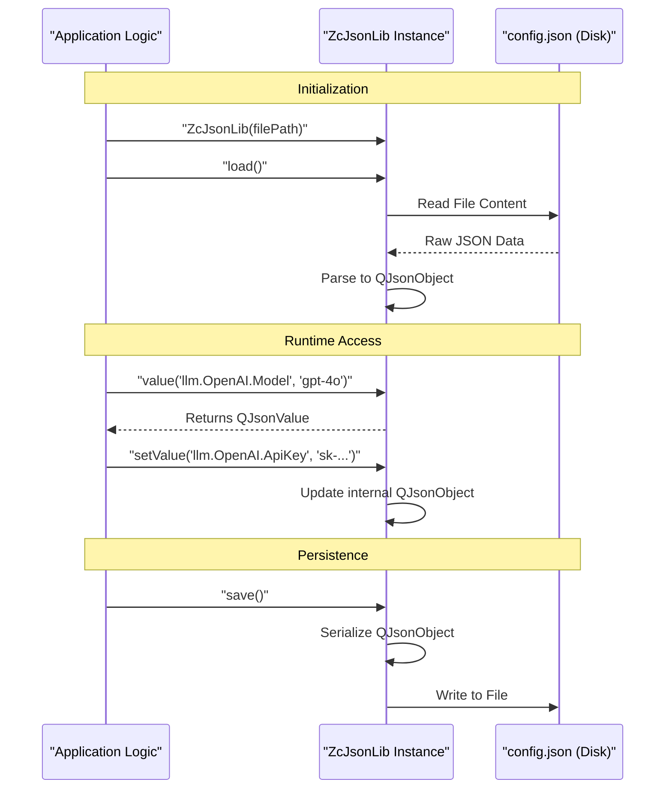
```mermaid
sequenceDiagram
    participant App as "Application Logic"
    participant Lib as "ZcJsonLib Instance"
    participant Disk as "config.json (Disk)"

    Note over App, Disk: Initialization
    App->>Lib: "ZcJsonLib(filePath)"
    App->>Lib: "load()"
    Lib->>Disk: Read File Content
    Disk-->>Lib: Raw JSON Data
    Lib->>Lib: Parse to QJsonObject

    Note over App, Disk: Runtime Access
    App->>Lib: "value('llm.OpenAI.Model', 'gpt-4o')"
    Lib-->>App: Returns QJsonValue

    App->>Lib: "setValue('llm.OpenAI.ApiKey', 'sk-...')"
    Lib->>Lib: Update internal QJsonObject

    Note over App, Disk: Persistence
    App->>Lib: "save()"
    Lib->>Lib: Serialize QJsonObject
    Lib->>Disk: Write to File
```
**Sources:** [3rdparty/ZcJsonLib/lib/libZcJsonLib.a:3](), [3rdparty/ZcJsonLib/lib/ZcJsonLib.lib:3-6]()

## Dot-Separated Key Paths

One of the most critical features of `ZcJsonLib` is its ability to handle nested JSON objects using a flat string key. This is implemented via the internal `splitKey` function [3rdparty/ZcJsonLib/lib/libZcJsonLib.a:3]().

### Implementation Logic
When `setValue("parent.child.key", value)` is called:
1.  The library splits the key by the `.` character.
2.  It traverses the internal `QJsonObject`, creating intermediate objects if they do not exist.
3.  It places the `QJsonValue` at the leaf node of the structure.

### Entity Mapping: Path to JSON Structure
This diagram bridges the natural language "Key Path" concept to the resulting "Code Entity" (JSON structure).

Title: Key Path to JSON Entity Mapping
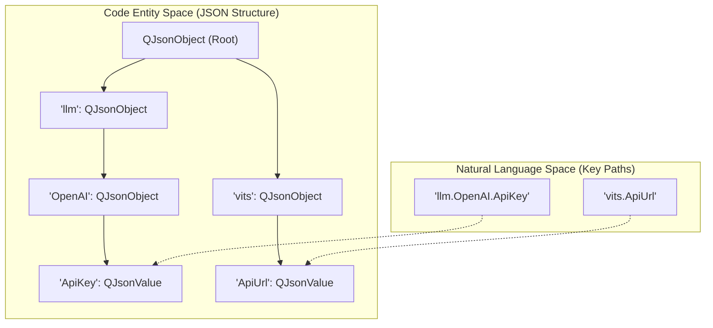
```mermaid
graph TD
    subgraph "Natural Language Space (Key Paths)"
        K1["'llm.OpenAI.ApiKey'"]
        K2["'vits.ApiUrl'"]
    end

    subgraph "Code Entity Space (JSON Structure)"
        Root["QJsonObject (Root)"]
        LLM["'llm': QJsonObject"]
        VITS["'vits': QJsonObject"]
        OAI["'OpenAI': QJsonObject"]
        Key["'ApiKey': QJsonValue"]
        URL["'ApiUrl': QJsonValue"]

        Root --> LLM
        Root --> VITS
        LLM --> OAI
        OAI --> Key
        VITS --> URL
    end

    K1 -.-> Key
    K2 -.-> URL
```
**Sources:** [3rdparty/ZcJsonLib/lib/libZcJsonLib.a:3](), [3rdparty/ZcJsonLib/lib/ZcJsonLib.lib:6]()

## Usage in ZcChat2 Subsystems

`ZcJsonLib` is used throughout the codebase to handle persistent settings that require a flexible schema, unlike the rigid structure of INI files.

### 1. LLM Settings Persistence
The `SettingChild_LLM` component uses `ZcJsonLib` to store API keys and model lists.
*   **Path Example:** `llm/{Provider}/ApiKey`
*   **Path Example:** `llm/{Provider}/ModelList`

### 2. VITS Voice Settings
`SettingChild_Vits` stores server configurations and speaker metadata.
*   **Path Example:** `vits/ApiUrl`
*   **Path Example:** `vits/ModelAndSpeakerList`

### 3. Character-Specific User Config
The application maintains a `config.json` for each character in the `UserConfig` directory. This file stores user preferences such as:
*   `tachieSize`: The scaling percentage of the character sprite.
*   `vitsEnable`: Boolean toggle for voice synthesis.
*   `prompt`: The system prompt used for AI personality.

**Sources:** [3rdparty/ZcJsonLib/lib/libZcJsonLib.a:3](), [3rdparty/ZcJsonLib/lib/ZcJsonLib.lib:3-6]()

---

<<< SECTION: 2.3 UI Utilities [2-3-ui-utilities] >>>

# UI Utilities

Relevant source files

The following files were used as context for generating this wiki page:

- [utils/CustomScrollBinder.cpp](utils/CustomScrollBinder.cpp)
- [utils/CustomScrollBinder.h](utils/CustomScrollBinder.h)
- [utils/DragHelper.cpp](utils/DragHelper.cpp)
- [utils/DragHelper.h](utils/DragHelper.h)
- [windows/dialog/dialog.ui](windows/dialog/dialog.ui)

The `utils/` directory contains helper classes that provide essential infrastructure for the application's frameless window design. Since ZcChat2 opts for a custom, non-native window appearance (transparent backgrounds, rounded corners, and custom overlays), it cannot rely on standard OS-provided title bars for dragging or default scroll bars that clash with the visual aesthetic.

## DragHelper

`DragHelper` is an event-filter-based utility that enables manual window dragging for frameless widgets. It is utilized by both the `Dialog` (chat window) and `Tachie` (character overlay) to allow users to reposition them on the desktop.

### Implementation Details
The class inherits from `QObject` and implements `eventFilter` to intercept mouse events before they reach the target widget [utils/DragHelper.h:7-14](). By installing itself as an event filter on the parent widget [utils/DragHelper.cpp:7-8](), it can track mouse movement without requiring the widget to override its own `mouseMoveEvent`.

### Dragging Logic
1.  **Press**: When `Qt::LeftButton` is pressed, the helper calculates the offset (`m_movePoint`) between the global mouse position and the widget's top-left corner [utils/DragHelper.cpp:16-25](). It calls `grabMouse()` to ensure events are captured even if the cursor leaves the widget boundaries.
2.  **Move**: As the mouse moves while the button is held, the widget's `move()` method is called with the new global position minus the initial offset [utils/DragHelper.cpp:28-37]().
3.  **Release**: Upon release, `releaseMouse()` is called, and the cursor is reset to `Qt::ArrowCursor` [utils/DragHelper.cpp:38-48]().

### Frameless Dragging Data Flow
The following diagram illustrates how `DragHelper` translates raw mouse events into window movement.

**Figure 1: DragHelper Event Translation**
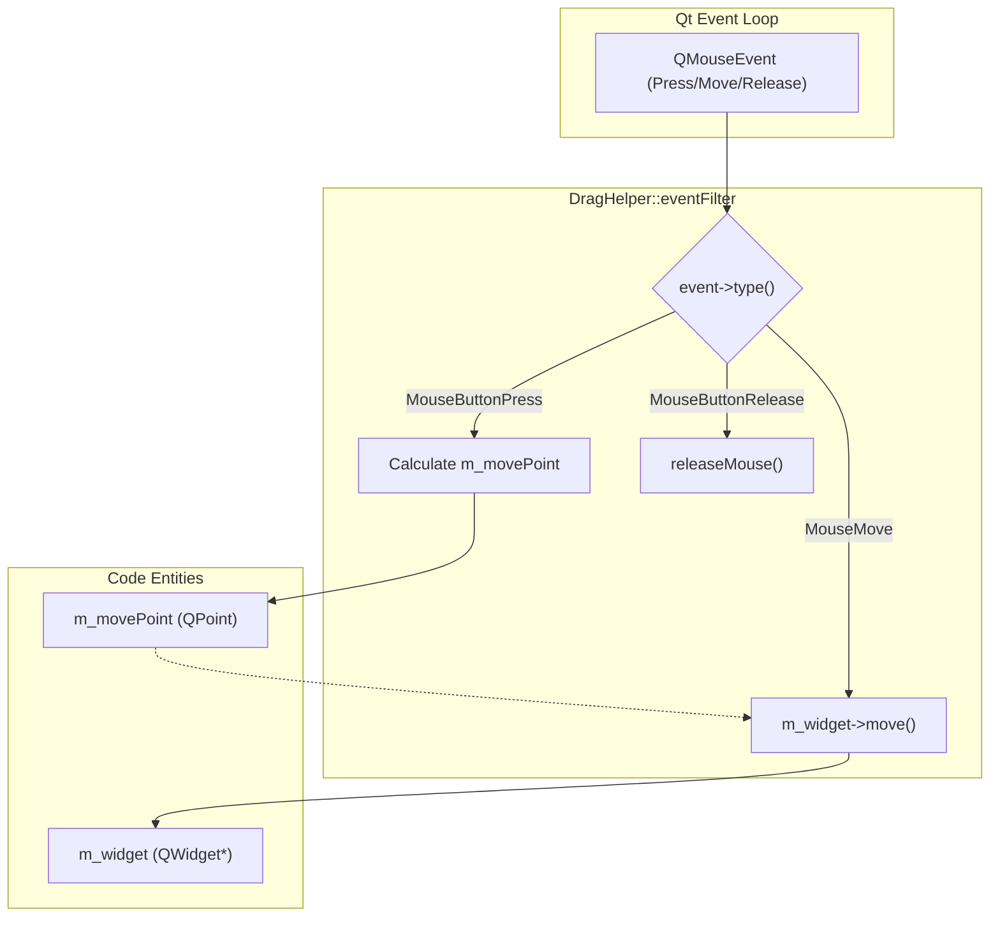
```mermaid
graph TD
    subgraph "Qt Event Loop"
        A["QMouseEvent (Press/Move/Release)"]
    end

    subgraph "DragHelper::eventFilter"
        B{"event->type()"}
        C["Calculate m_movePoint"]
        D["m_widget->move()"]
        E["releaseMouse()"]
    end

    subgraph "Code Entities"
        F["m_widget (QWidget*)"]
        G["m_movePoint (QPoint)"]
    end

    A --> B
    B -- "MouseButtonPress" --> C
    C --> G
    B -- "MouseMove" --> D
    G -.-> D
    D --> F
    B -- "MouseButtonRelease" --> E
```
Sources: [utils/DragHelper.h:7-20](), [utils/DragHelper.cpp:10-53]()

---

## CustomScrollBinder

`CustomScrollBinder` synchronizes the internal scroll state of a `QTextEdit` with an external, custom-styled `QScrollBar`. This is necessary because the `Dialog` window hides the default `QTextEdit` scrollbars [windows/dialog/dialog.ui:127-132]() to maintain a clean UI, using a separate `QScrollBar` widget named `verticalScrollBar` [windows/dialog/dialog.ui:142]() instead.

### Synchronization Mechanism
The binder establishes a two-way synchronization with an optional scaling factor (`m_scale`) to handle precision differences between the text document height and the scrollbar range [utils/CustomScrollBinder.h:11-21]().

| Feature | Logic | Source |
| :--- | :--- | :--- |
| **Range Sync** | Updates `m_customScrollBar` range and page step when the `QTextEdit` content changes. | [utils/CustomScrollBinder.cpp:23-30]() |
| **Visibility** | Automatically hides the custom scrollbar if the content fits within the view (`max > min`). | [utils/CustomScrollBinder.cpp:29]() |
| **User Input** | Translates `sliderMoved` or `actionTriggered` (page up/down) on the custom bar to `scroll->setValue()`. | [utils/CustomScrollBinder.cpp:33-49]() |
| **Internal Sync** | Updates the custom bar position if the `QTextEdit` scrolls internally (e.g., via wheel or text insertion). | [utils/CustomScrollBinder.cpp:52-56]() |

### Use of QSignalBlocker
To prevent infinite recursion (where updating the scrollbar triggers a signal that updates the text edit, which triggers a signal back to the scrollbar), the binder uses `QSignalBlocker` during every synchronization step [utils/CustomScrollBinder.cpp:25, 35, 45, 54]().

### Scroll Synchronization Flow
This diagram maps the interaction between the UI components and the binder logic.

**Figure 2: CustomScrollBinder Coordination**
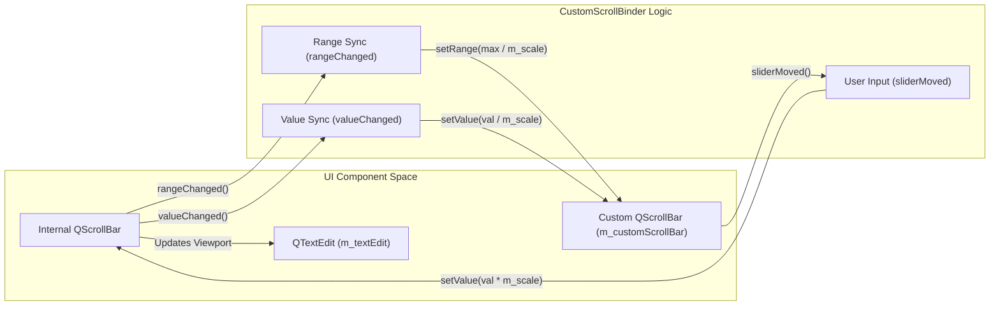
```mermaid
graph LR
    subgraph "UI Component Space"
        TE["QTextEdit (m_textEdit)"]
        IS["Internal QScrollBar"]
        CS["Custom QScrollBar (m_customScrollBar)"]
    end

    subgraph "CustomScrollBinder Logic"
        RS["Range Sync (rangeChanged)"]
        VS["Value Sync (valueChanged)"]
        UI["User Input (sliderMoved)"]
    end

    IS -- "rangeChanged()" --> RS
    RS -- "setRange(max / m_scale)" --> CS
    IS -- "valueChanged()" --> VS
    VS -- "setValue(val / m_scale)" --> CS
    CS -- "sliderMoved()" --> UI
    UI -- "setValue(val * m_scale)" --> IS
    IS -- "Updates Viewport" --> TE
```
Sources: [utils/CustomScrollBinder.cpp:4-57](), [windows/dialog/dialog.ui:142-208]()

---

## Summary Table: UI Utility Usage

| Class | Primary Target | Purpose | Key Qt Mechanism |
| :--- | :--- | :--- | :--- |
| `DragHelper` | `Dialog`, `Tachie` | Enables window dragging for frameless UI. | `QObject::installEventFilter` |
| `CustomScrollBinder` | `Dialog->textEdit` | Connects a hidden internal scrollbar to a visible custom one. | `QScrollBar::valueChanged`, `QSignalBlocker` |

Sources: [utils/DragHelper.h:11](), [utils/CustomScrollBinder.h:11-16](), [windows/dialog/dialog.ui:48-142]()

---

<<< SECTION: 3 Tachie — Character Overlay Window [3-tachie-character-overlay-window] >>>

# Tachie — Character Overlay Window

Relevant source files

The following files were used as context for generating this wiki page:

- [windows/tachie/tachie.cpp](windows/tachie/tachie.cpp)
- [windows/tachie/tachie.h](windows/tachie/tachie.h)
- [windows/tachie/tachie.ui](windows/tachie/tachie.ui)

The `Tachie` subsystem is responsible for the visual representation of the AI character on the user's desktop. It is implemented as a specialized `QWidget` that functions as a frameless, translucent, and "always-on-top" overlay. Unlike the standard chat window, the `Tachie` window is designed to host high-quality character sprites (立绘) with support for per-pixel transparency and interaction handling that allows users to click through transparent regions to the desktop behind it.

### System Role and Initialization

The `Tachie` class is instantiated in `main.cpp` and serves as one of the two primary windows in the application lifecycle. To ensure the UI is responsive during startup, it utilizes a `QTimer::singleShot` to defer the initial image loading and rendering until the event loop has started [windows/tachie/tachie.cpp:31-32]().

**Window Characteristics:**
*   **Frameless:** Uses `Qt::FramelessWindowHint` to remove standard OS window decorations [windows/tachie/tachie.cpp:26]().
*   **Always-on-top:** Set with `Qt::WindowStaysOnTopHint` to remain visible above other applications [windows/tachie/tachie.cpp:26]().
*   **Translucent:** Enables `Qt::WA_TranslucentBackground` to support PNG alpha channels [windows/tachie/tachie.cpp:25]().
*   **Draggable:** Integrated with `DragHelper` to allow users to reposition the character anywhere on the screen [windows/tachie/tachie.cpp:28]().

**Tachie Entity Relationship**
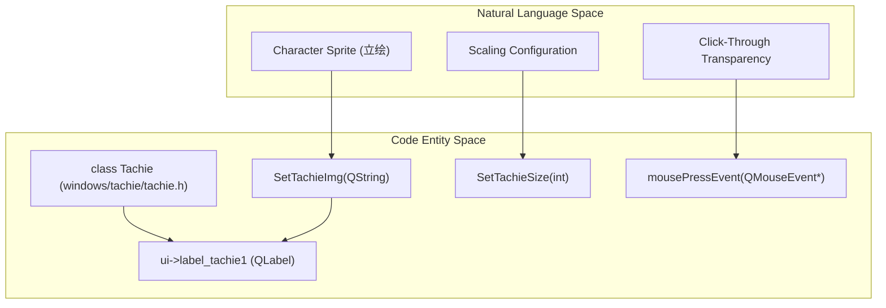
```mermaid
graph TD
    subgraph "Natural Language Space"
        CharacterSprite["Character Sprite (立绘)"]
        ClickThrough["Click-Through Transparency"]
        ScaleConfig["Scaling Configuration"]
    end

    subgraph "Code Entity Space"
        TachieClass["class Tachie (windows/tachie/tachie.h)"]
        SetTachieImg["SetTachieImg(QString)"]
        SetTachieSize["SetTachieSize(int)"]
        MousePress["mousePressEvent(QMouseEvent*)"]
        LabelTachie["ui->label_tachie1 (QLabel)"]
    end

    CharacterSprite --> SetTachieImg
    ClickThrough --> MousePress
    ScaleConfig --> SetTachieSize
    TachieClass --> LabelTachie
    SetTachieImg --> LabelTachie
```
**Sources:** [windows/tachie/tachie.cpp:19-33](), [windows/tachie/tachie.h:11-39]()

---

### Rendering & Scaling

The rendering pipeline transforms raw character assets into scaled desktop overlays. The system uses a dual-buffer approach, maintaining a source `QPixmap` (`NowTachie`) for the original asset and a scaled `QImage` (`_scaledImg`) for interaction detection and display [windows/tachie/tachie.h:29-30]().

When `SetTachieImg()` is called, the system resolves the file path via `ReadCharacterTachiePath()` and applies a percentage-based scaling factor retrieved from the character's `UserConfig` [windows/tachie/tachie.cpp:41-47](). The scaling uses `Qt::SmoothTransformation` to maintain visual quality [windows/tachie/tachie.cpp:56]().

For a deep dive into the image loading path, buffer management, and scaling math, see **[Tachie Rendering & Scaling](#3.1)**.

**Sources:** [windows/tachie/tachie.cpp:41-60](), [windows/tachie/tachie.h:23-24]()

---

### Interaction & Click-Through

Because the `Tachie` window is often large and overlaps other desktop elements, it implements "click-through" logic. This ensures that only clicks on the actual visible pixels of the character are intercepted by the application, while clicks on transparent areas are passed to the windows underneath.

The implementation is platform-specific:
*   **Linux (X11):** Uses the `XShape` extension (`XShapeCombineRectangles`) to define a precise input mask based on the image's alpha channel [windows/tachie/tachie.cpp:66-95]().
*   **Windows:** Utilizes `setMask(pixmap.mask())` as a fallback [windows/tachie/tachie.cpp:98]().
*   **Manual Validation:** An override of `mousePressEvent` performs a secondary check on the alpha value of the specific pixel clicked. If the alpha is below a threshold (10), the event is ignored [windows/tachie/tachie.cpp:104-120]().

For technical details on the X11 `ShapeInput` implementation and the alpha-threshold logic, see **[Click-Through & Mouse Transparency](#3.2)**.

**Sources:** [windows/tachie/tachie.cpp:62-120](), [windows/tachie/tachie.h:38]()

---

### Integration with Rest of Application

The `Tachie` window communicates with the `Dialog` and `Settings` windows primarily through Qt's signal-slot mechanism.

| Feature | Mechanism | Code Reference |
| :--- | :--- | :--- |
| **Mood Change** | `SetTachieImg(QString)` slot | [windows/tachie/tachie.h:23]() |
| **Resize** | `SetTachieSize(int)` slot | [windows/tachie/tachie.h:24]() |
| **Toggle Chat** | `requestToggleVisible()` signal | [windows/tachie/tachie.h:20]() |
| **Reset Position** | `ResetTachieLoc()` slot | [windows/tachie/tachie.h:25]() |

The `contextMenuEvent` is overloaded to emit `requestToggleVisible()`, allowing users to right-click the character to show or hide the chat dialog [windows/tachie/tachie.h:33-36]().

**Tachie Interaction Flow**
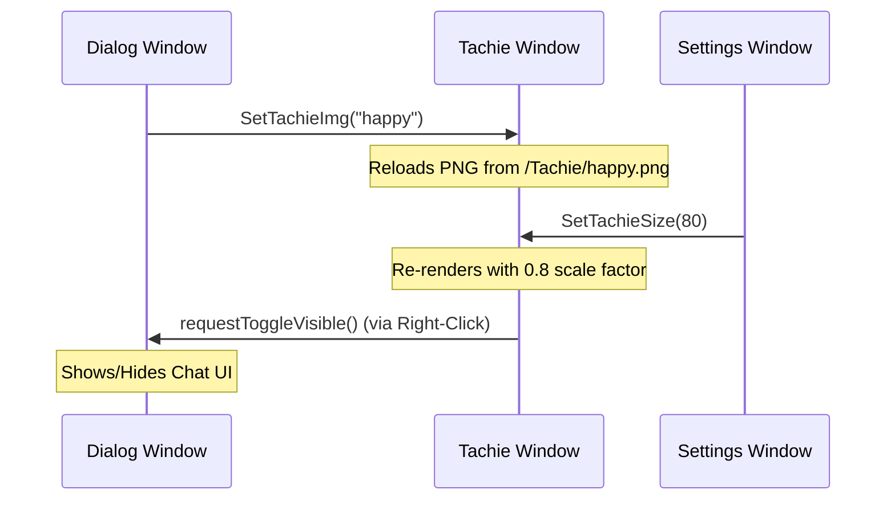
```mermaid
sequenceDiagram
    participant D as Dialog Window
    participant T as Tachie Window
    participant S as Settings Window

    D->>T: SetTachieImg("happy")
    Note over T: Reloads PNG from /Tachie/happy.png
    S->>T: SetTachieSize(80)
    Note over T: Re-renders with 0.8 scale factor
    T->>D: requestToggleVisible() (via Right-Click)
    Note over D: Shows/Hides Chat UI
```

**Sources:** [windows/tachie/tachie.cpp:123-126](), [windows/tachie/tachie.h:19-39]()

---

<<< SECTION: 3.1 Tachie Rendering & Scaling [3-1-tachie-rendering-scaling] >>>

# Tachie Rendering & Scaling

Relevant source files

The following files were used as context for generating this wiki page:

- [windows/tachie/tachie.cpp](windows/tachie/tachie.cpp)
- [windows/tachie/tachie.h](windows/tachie/tachie.h)
- [windows/tachie/tachie.ui](windows/tachie/tachie.ui)

The `Tachie` class represents the character's visual presence on the desktop. It is a frameless, translucent `QWidget` that handles the loading, scaling, and rendering of character sprites (立绘). The rendering pipeline is designed to maintain high visual quality while supporting dynamic resizing and complex input transparency.

## Image Pipeline Overview

The image pipeline begins with a request to change the character's mood or state, which triggers a path resolution and loading sequence. The pipeline ensures that the original high-resolution asset is preserved while a scaled version is cached for UI rendering and collision detection.

### 1. Path Construction and Loading
The process is initiated via `SetTachieImg(QString TachieName)`. 
- **Path Resolution**: It uses `ReadCharacterTachiePath()` to locate the character's asset directory and appends the requested `TachieName` with a `.png` extension [windows/tachie/tachie.cpp:41-43]().
- **Source Buffer**: The raw image is loaded into `NowTachie`, a `QPixmap` member variable that acts as the high-quality source buffer [windows/tachie/tachie.h:29](), [windows/tachie/tachie.cpp:43]().
- **Configuration Retrieval**: The function then initializes a `ZcJsonLib` instance for the character's user configuration to retrieve the `tachieSize` percentage [windows/tachie/tachie.cpp:44-46]().

### 2. Percentage-Based Scaling
Once the source image and target size are identified, `SetTachieSize(int size)` performs the transformation:
- **Scaling Algorithm**: The `NowTachie` pixmap is scaled using `Qt::SmoothTransformation` to prevent aliasing, maintaining the aspect ratio via `Qt::KeepAspectRatio` [windows/tachie/tachie.cpp:53-56]().
- **Dual-Buffer Design**: 
    - **`NowTachie` (QPixmap)**: Stores the original image to avoid quality loss during repeated scaling operations [windows/tachie/tachie.h:29]().
    - **`_scaledImg` (QImage)**: Stores a converted version of the scaled pixmap. This `QImage` is used specifically for per-pixel alpha testing in mouse events because `QImage` provides faster pixel-level access than `QPixmap` [windows/tachie/tachie.h:30](), [windows/tachie/tachie.cpp:60]().

### 3. UI Update
The final `scaledPixmap` is applied to `ui->label_tachie1`, and the `Tachie` window itself is resized to match the dimensions of the scaled image [windows/tachie/tachie.cpp:58-64]().

**Sources:** [windows/tachie/tachie.cpp:41-65](), [windows/tachie/tachie.h:11-41]()

## Implementation Flow

The following diagram illustrates the data flow from configuration files to the on-screen `QLabel`.

### Tachie Image Data Flow
```mermaid
graph TD
    subgraph "Configuration & Filesystem"
        A["config.json"] -- "tachieSize" --> B["ZcJsonLib"]
        C["Tachie/Directory"] -- ".png files" --> D["ReadCharacterTachiePath()"]
    end

    subgraph "Tachie Class Entities"
        E["SetTachieImg(TachieName)"]
        F["NowTachie (QPixmap)"]
        G["SetTachieSize(size)"]
        H["_scaledImg (QImage)"]
        I["ui->label_tachie1 (QLabel)"]
    end

    D --> E
    E --> F
    B --> G
    F -- "Source" --> G
    G -- "toImage()" --> H
    G -- "setPixmap()" --> I
```
**Sources:** [windows/tachie/tachie.cpp:41-60](), [windows/tachie/tachie.h:27-31]()

## Deferred Initialization

The `Tachie` constructor does not load the image immediately. Instead, it uses `QTimer::singleShot(0, ...)` to defer the initial call to `SetTachieImg("default")` [windows/tachie/tachie.cpp:31-32](). This ensures that the event loop starts and the widget's basic properties are initialized before the heavy image processing and window masking operations begin.

### Initialization Sequence
```mermaid
sequenceDiagram
    participant M as main.cpp
    participant T as Tachie (QWidget)
    participant H as DragHelper
    participant Q as QTimer

    M->>T: new Tachie()
    activate T
    T->>T: setAttribute(Qt::WA_TranslucentBackground)
    T->>T: setWindowFlags(Qt::FramelessWindowHint)
    T->>H: new DragHelper(this)
    T->>Q: singleShot(0, SetTachieImg)
    deactivate T
    Note over Q: Next Event Loop Iteration
    Q->>T: SetTachieImg("default")
    T->>T: SetTachieSize(configValue)
```
**Sources:** [windows/tachie/tachie.cpp:19-33](), [windows/tachie/tachie.h:16]()

## Technical Details

### Key Functions and Roles

| Entity | Role | Source |
| :--- | :--- | :--- |
| `SetTachieImg` | Orchestrates path resolution and loading of the `NowTachie` buffer. | [windows/tachie/tachie.cpp:41]() |
| `SetTachieSize` | Calculates new dimensions and updates the `_scaledImg` cache. | [windows/tachie/tachie.cpp:49]() |
| `NowTachie` | `QPixmap` holding the unscaled original asset. | [windows/tachie/tachie.h:29]() |
| `_scaledImg` | `QImage` used for pixel-perfect mouse hit testing. | [windows/tachie/tachie.h:30]() |
| `tachieSize` | Config key (integer) representing scaling percentage (e.g., 100 = 1.0x). | [windows/tachie/tachie.cpp:46]() |

### Scaling Logic Implementation
The scaling math uses a floating-point multiplier derived from the integer config value:
`NowTachie.size() * (size / 100.0)` [windows/tachie/tachie.cpp:54](). 

By using `Qt::SmoothTransformation`, the engine performs bilinear or bicubic filtering (depending on the Qt backend), which is essential for maintaining the visual fidelity of the character's line art when the user scales the "pet" on their desktop [windows/tachie/tachie.cpp:56]().

**Sources:** [windows/tachie/tachie.cpp:49-65](), [windows/tachie/tachie.h:22-31]()

---

<<< SECTION: 3.2 Click-Through & Mouse Transparency [3-2-click-through-mouse-transparency] >>>

# Click-Through & Mouse Transparency

Relevant source files

The following files were used as context for generating this wiki page:

- [windows/tachie/tachie.cpp](windows/tachie/tachie.cpp)
- [windows/tachie/tachie.h](windows/tachie/tachie.h)

The `Tachie` window functions as a desktop overlay, requiring a sophisticated approach to input handling. To maintain the illusion of a "desktop pet," the window must be visually seamless while allowing the user to click through transparent areas of the character sprite to interact with underlying desktop icons or windows. This is achieved through a combination of platform-specific window masking and per-pixel alpha testing.

## Input Masking Implementation

The primary mechanism for mouse transparency is defined within `Tachie::SetTachieSize`. When the character sprite is scaled and updated, the application recalculates the interactive boundary of the window.

### Linux (X11) Implementation
On Linux systems using the X11 windowing system, the application utilizes the `XShape` extension to provide high-quality input masking. Unlike standard masking which can cause aliasing (jagged edges), this approach uses `ShapeInput` to separate the visual shape from the input shape.

1.  **Alpha Mask Extraction**: The `QPixmap` of the scaled character is converted to a `QImage`, and `createAlphaMask()` is called to generate a 1-bit mask where alpha > 0 [windows/tachie/tachie.cpp:72-74]().
2.  **Region Conversion**: This mask is converted into a `QRegion`, which Qt breaks down into a series of non-overlapping rectangles [windows/tachie/tachie.cpp:77-78]().
3.  **X11 Shape Integration**: These rectangles are mapped to `XRectangle` structures and passed to `XShapeCombineRectangles` using the `ShapeInput` parameter [windows/tachie/tachie.cpp:79-90](). This tells the X Server to only intercept mouse events within these rectangles while leaving the visual rendering untouched.

### Windows Fallback
On Windows, the application utilizes the standard Qt masking API. The `setMask()` function is called with the bitmap mask of the scaled pixmap [windows/tachie/tachie.cpp:98](). This restricts both the rendering and the input area to the non-transparent pixels of the sprite.

### Data Flow: Image to Input Mask

Title: Input Masking Pipeline
```mermaid
graph TD
    subgraph "Image Processing"
        A["NowTachie (QPixmap)"] -->|"[windows/tachie/tachie.cpp:53-56]"| B["scaledPixmap (QPixmap)"]
        B -->|"[windows/tachie/tachie.cpp:60]"| C["_scaledImg (QImage)"]
    end

    subgraph "Platform Masking"
        B --> D{Platform?}
        D -->|Linux X11| E["createAlphaMask()"]
        E --> F["QRegion"]
        F --> G["XRectangle Array"]
        G -->|"[windows/tachie/tachie.cpp:90]"| H["XShapeCombineRectangles(ShapeInput)"]
        
        D -->|Windows| I["scaledPixmap.mask()"]
        I -->|"[windows/tachie/tachie.cpp:98]"| J["Tachie::setMask()"]
    end
```
Sources: [windows/tachie/tachie.cpp:53-100](), [windows/tachie/tachie.h:29-30]()

## Per-Pixel Alpha Verification

While the window-level masks handle the broad input redirection, `Tachie` implements a secondary check in `mousePressEvent` to handle semi-transparent edges and provide finer control over what constitutes a "hit."

The `_scaledImg` (a `QImage` cached during the scaling process) is used to sample the alpha value at the exact coordinate of the mouse click [windows/tachie/tachie.cpp:106-111]().

*   **Threshold**: If the alpha value of the pixel at the click position is less than **10**, the event is considered a "miss" [windows/tachie/tachie.cpp:113]().
*   **Event Ignoring**: When a miss occurs, `event->ignore()` is called [windows/tachie/tachie.cpp:114](). This allows the event to propagate through the transparent part of the window to the desktop or windows behind it.
*   **Event Acceptance**: If the alpha is $\ge 10$, the event is passed to the base `QWidget::mousePressEvent`, allowing for window dragging via `DragHelper` [windows/tachie/tachie.cpp:119]().

### Interaction Logic Flow

Title: Mouse Press Event Resolution
```mermaid
graph TD
    START["mousePressEvent(QMouseEvent *event)"] --> VALID{"Coord inside _scaledImg?"}
    VALID -- "No" --> BASE["QWidget::mousePressEvent(event)"]
    VALID -- "Yes" --> ALPHA["Get alpha via _scaledImg.pixelColor(pos)"]
    
    ALPHA --> CHECK{"alpha < 10?"}
    CHECK -- "Yes (Transparent)" --> IGNORE["event->ignore()"]
    CHECK -- "No (Opaque)" --> BASE
    
    IGNORE --> EXIT["Event passes to desktop"]
    BASE --> DRAG["DragHelper processes move"]
```
Sources: [windows/tachie/tachie.cpp:104-120](), [windows/tachie/tachie.h:38](), [utils/DragHelper.h:1-28]()

## Key Functions and Entities

| Entity | Role | Location |
| :--- | :--- | :--- |
| `_scaledImg` | A cached `QImage` used for per-pixel alpha lookups during mouse events. | [windows/tachie/tachie.h:30]() |
| `ShapeInput` | X11 constant used to define the input boundary independently of the visual boundary. | [windows/tachie/tachie.cpp:90]() |
| `createAlphaMask()` | Generates a 1-bit mask used to build the `QRegion` for Linux input masking. | [windows/tachie/tachie.cpp:74]() |
| `pixelColor()` | Qt 6 method used to retrieve the RGBA values of a specific coordinate. | [windows/tachie/tachie.cpp:111]() |
| `event->ignore()` | Signals to the window manager that the click should fall through to the background. | [windows/tachie/tachie.cpp:114]() |

Sources: [windows/tachie/tachie.cpp:1-127](), [windows/tachie/tachie.h:1-41]()

---

<<< SECTION: 4 Dialog — Chat Interaction Window [4-dialog-chat-interaction-window] >>>

# Dialog — Chat Interaction Window

Relevant source files

The following files were used as context for generating this wiki page:

- [windows/dialog/dialog.cpp](windows/dialog/dialog.cpp)
- [windows/dialog/dialog.h](windows/dialog/dialog.h)
- [windows/dialog/dialog.ui](windows/dialog/dialog.ui)

The `Dialog` window serves as the primary interaction hub between the user and the AI character. It provides a Galgame-style text interface, manages the input/output lifecycle for LLM communications, and coordinates secondary effects like voice synthesis and character sprite (Tachie) updates.

## Overview

The `Dialog` class [windows/dialog/dialog.h:16-63]() is a frameless, translucent `QWidget` [windows/dialog/dialog.cpp:55-57]() that renders as a rounded rectangle with a custom drop shadow [windows/dialog/dialog.cpp:30-50](). It orchestrates the flow of data between the user's text input, the `AiProvider` backend, and the `history` window.

### Key Responsibilities
*   **Input Handling**: Captures user text via a `QTextEdit` and triggers the AI pipeline on `Qt::Key_Return` [windows/dialog/dialog.cpp:180-184]().
*   **Visual Orchestration**: Emits signals to update the `Tachie` window's mood based on AI responses [windows/dialog/dialog.cpp:158]().
*   **Audio Synthesis**: Triggers VITS voice generation for character replies [windows/dialog/dialog.cpp:157]().
*   **Context Management**: Maintains a rolling history of the conversation to provide memory for the LLM [windows/dialog/dialog.cpp:113-121]().

### Component Relationship
The following diagram illustrates how `Dialog` acts as the central controller for the interaction experience.

**Interaction Orchestration Map**
```mermaid
graph TD
    subgraph "Dialog Window (Code Space)"
        D["Dialog Class"]
        AI["AiProvider (ZcAILib)"]
        HIST["history Window"]
        SB["CustomScrollBinder"]
        DH["DragHelper"]
    end

    subgraph "External Subsystems"
        T["Tachie Window"]
        VITS["VITS API Server"]
        LLM["LLM API (OpenAI/DeepSeek)"]
    end

    D -- "1. chat()" --> AI
    AI -- "2. replyReceived" --> D
    D -- "3. requestSetCharTachie()" --> T
    D -- "4. VitsGetAndPlay()" --> VITS
    D -- "5. addChildWindow()" --> HIST
    
    D -- "Uses" --> SB
    D -- "Uses" --> DH
    AI -- "Network" --> LLM
```
Sources: [windows/dialog/dialog.cpp:131-166](), [windows/dialog/dialog.h:57-58](), [windows/dialog/dialog.cpp:61-63]()

---

## AI Interaction Pipeline {#4.1}

The interaction starts when the user presses **Enter** (without Shift). The `Dialog` class captures this in `keyReleaseEvent` [windows/dialog/dialog.cpp:180-182](), extracts the text, and prepares a `systemPrompt`. This prompt is dynamically built by scanning the character's `Tachie` directory for available mood filenames [windows/dialog/dialog.cpp:200-207]() to ensure the AI only requests valid expressions.

The message is then sent via `AiProvider::chat()`. When a response arrives, it is parsed using a pipe-delimited format (`Mood|Chinese|Japanese`) [windows/dialog/dialog.cpp:149-150](). The `mood` is sent to the `Tachie` window via the `requestSetCharTachie` signal [windows/dialog/dialog.cpp:158]().

For a detailed walkthrough of prompt construction and response parsing, see [AI Interaction Pipeline](#4.1).

Sources: [windows/dialog/dialog.cpp:180-225](), [windows/dialog/dialog.cpp:148-166]()

---

## VITS Voice Synthesis Integration {#4.2}

If enabled in the character's `UserConfig`, the `Dialog` window automatically invokes `VitsGetAndPlay()` upon receiving a text response [windows/dialog/dialog.cpp:156-157](). This method handles the asynchronous network request to a VITS server, manages a `QTemporaryFile` for the audio data, and utilizes `QMediaPlayer` for playback.

The integration supports URL-encoding of the response text and maps character-specific VITS settings (like speaker ID and server URL) to the API request.

For details on the audio networking and playback lifecycle, see [VITS Voice Synthesis Integration](#4.2).

Sources: [windows/dialog/dialog.cpp:154-157](), [windows/dialog/dialog.h:25]()

---

## Conversation History Window {#4.3}

The `history` window is a child component of `Dialog` that provides a scrollable view of the current session's dialogue. It is synchronized with the main dialog window in several ways:
*   **Movement**: Overrides `moveEvent` to ensure the history panel follows the dialog when dragged [windows/dialog/dialog.cpp:45]().
*   **Visibility**: Can be toggled via a button or mouse wheel events (`handleWheelUp`/`handleWheelDown`) [windows/dialog/dialog.cpp:69-76]().
*   **Persistence**: Conversations are saved to and loaded from `context.json` using `loadContextHistory()` and `saveContextHistory()` [windows/dialog/dialog.cpp:79-110]().

For details on the history UI implementation and animations, see [Conversation History Window](#4.3).

Sources: [windows/dialog/dialog.cpp:138](), [windows/dialog/dialog.cpp:45](), [windows/dialog/dialog.cpp:69-76]()

---

## UI and Rendering

The `Dialog` window utilizes several specialized utilities to achieve its modern look and feel:

| Feature | Implementation | File Reference |
| :--- | :--- | :--- |
| **Frameless Design** | `Qt::FramelessWindowHint` | [windows/dialog/dialog.cpp:55]() |
| **Rounded Corners** | `QPainterPath::addRoundedRect` | [windows/dialog/dialog.cpp:34]() |
| **Drop Shadow** | Manual `QPainter` loop with decreasing alpha | [windows/dialog/dialog.cpp:39-49]() |
| **Dragging** | `DragHelper` utility | [windows/dialog/dialog.cpp:63]() |
| **Custom Scroll** | `CustomScrollBinder` (binds `QTextEdit` to external `QScrollBar`) | [windows/dialog/dialog.cpp:61-62]() |

**UI Entity Mapping**
```mermaid
graph LR
    subgraph "Dialog.ui (XML Layout)"
        UI_TE["textEdit (QTextEdit)"]
        UI_VSB["verticalScrollBar (QScrollBar)"]
        UI_BN["pushButton_next (QPushButton)"]
        UI_BH["pushButton_history (QPushButton)"]
    end

    subgraph "Dialog.cpp (Logic)"
        C_CSB["CustomScrollBinder"]
        C_DH["DragHelper"]
        C_PE["paintEvent()"]
    end

    UI_TE -- "Bound by" --> C_CSB
    UI_VSB -- "Bound by" --> C_CSB
    UI_TE -- "Filtered by" --> C_DH
    C_PE -- "Draws" --> UI_TE
```
Sources: [windows/dialog/dialog.ui:48-238](), [windows/dialog/dialog.cpp:61-65]()

---

<<< SECTION: 4.1 AI Interaction Pipeline [4-1-ai-interaction-pipeline] >>>

# AI Interaction Pipeline

Relevant source files

The following files were used as context for generating this wiki page:

- [3rdparty/ZcAILib/include/AiProvider.h](3rdparty/ZcAILib/include/AiProvider.h)
- [3rdparty/ZcJsonLib/include/ZcJsonLib.h](3rdparty/ZcJsonLib/include/ZcJsonLib.h)
- [3rdparty/ZcWidgetTools/include/ZcStackedWidget.h](3rdparty/ZcWidgetTools/include/ZcStackedWidget.h)
- [windows/dialog/dialog.cpp](windows/dialog/dialog.cpp)
- [windows/dialog/dialog.h](windows/dialog/dialog.h)

The AI Interaction Pipeline in ZcChat2 governs the complete lifecycle of a user-character conversation. It transforms raw text input into a structured LLM (Large Language Model) request, manages context-aware history, and parses multi-modal responses to synchronize character visuals (Tachie) with generated text and voice.

## Pipeline Overview

The interaction is orchestrated by the `Dialog` class, which acts as the central controller for the chat UI and the `AiProvider` backend. The process is triggered by user keyboard events and follows a strictly defined format to ensure the "Desktop Pet" persona remains consistent.

### Sequence Diagram: User Input to Character Response

The following diagram illustrates the flow from the moment the "Enter" key is pressed to the point where the character's mood and voice are updated.

**AI Interaction Flow**
```mermaid
sequenceDiagram
    participant U as User (Keyboard)
    participant D as Dialog [windows/dialog/dialog.cpp]
    participant P as AiProvider [3rdparty/ZcAILib]
    participant LLM as LLM API (DeepSeek/OpenAI)
    participant T as Tachie [windows/tachie/tachie.cpp]

    U->>D: keyReleaseEvent (Qt::Key_Return)
    D->>D: buildUserMessageWithContext()
    D->>D: Construct System Prompt (Moods + Character Config)
    D->>P: chat(processedInput)
    P->>LLM: POST /v1/chat/completions
    LLM-->>P: "Mood|Chinese|Japanese"
    P->>D: replyReceived(reply)
    D->>D: Parse pipe-delimited string
    D->>T: emit requestSetCharTachie(mood)
    D->>D: VitsGetAndPlay(chineseReply)
    D->>D: saveContextHistory()
```
**Sources:** [windows/dialog/dialog.cpp:148-166](), [windows/dialog/dialog.cpp:180-230](), [3rdparty/ZcAILib/include/AiProvider.h:46-53]()

---

## Input Capture and Context Injection

### Triggering the Request
The pipeline begins in `Dialog::keyReleaseEvent`. It filters for the `Qt::Key_Return` (Enter) key while ensuring `Qt::Key_Shift` is not held (which allows for multi-line input) [windows/dialog/dialog.cpp:180-183](). Upon trigger, the UI is temporarily disabled to prevent duplicate requests [windows/dialog/dialog.cpp:186-187]().

### Context Construction
To maintain conversation continuity, `Dialog` utilizes a context-aware history system:
1.  **Context Loading**: On initialization, `loadContextHistory()` reads previous exchanges from `context.json` via `ReadCharacterContextPath()` [windows/dialog/dialog.cpp:79-93]().
2.  **Message Building**: `buildUserMessageWithContext()` prepends the last several lines of dialogue to the current user input, instructing the AI to "continue the context and maintain persona consistency" [windows/dialog/dialog.cpp:113-121]().

**Sources:** [windows/dialog/dialog.cpp:79-93](), [windows/dialog/dialog.cpp:113-121](), [windows/dialog/dialog.cpp:180-198]()

---

## Prompt Engineering and Asset Integration

The system prompt is dynamically generated to ensure the LLM only outputs valid character states (moods) based on the files actually present on the disk.

### Tachie Mood Scanning
Before sending the request, the `Dialog` scans the character's tachie directory using `ReadCharacterTachiePath()` [windows/dialog/dialog.cpp:200](). It filters for supported image formats (`.png`, `.jpg`, `.jpeg`) and extracts the filenames (e.g., "happy", "sad") to create a `nameListStr` [windows/dialog/dialog.cpp:201-207]().

### System Prompt Structure
The final system prompt is a concatenation of:
1.  **Character Persona**: Loaded from the character's `config.json` "prompt" key [windows/dialog/dialog.cpp:208-216]().
2.  **Format Constraint**: Instructions to strictly output in `Mood|Chinese|Japanese` format [windows/dialog/dialog.cpp:218-220]().
3.  **Valid Moods**: The `nameListStr` generated from actual disk assets, ensuring the AI does not request a mood that doesn't have a corresponding image [windows/dialog/dialog.cpp:221-222]().

**Sources:** [windows/dialog/dialog.cpp:200-222](), [GlobalConstants.h:1-20]()

---

## Async Execution and Response Parsing

The `AiProvider` class (from `ZcAILib`) handles the asynchronous network communication with the LLM provider.

### The Chat Call
`AiProvider::chat()` is invoked with the combined context and prompt [windows/dialog/dialog.cpp:229](). This is a non-blocking call that eventually triggers the `replyReceived` signal [3rdparty/ZcAILib/include/AiProvider.h:53]().

### Pipe-Delimited Parsing
When a response arrives, `Dialog` parses the string using the `|` delimiter [windows/dialog/dialog.cpp:149-150]():
*   **Index 0 (Mood)**: Emitted via `requestSetCharTachie(mood)` to update the character sprite [windows/dialog/dialog.cpp:158]().
*   **Index 1 (Chinese)**: Displayed in the `textEdit` and passed to the VITS engine for voice synthesis [windows/dialog/dialog.cpp:152-157]().

**Sources:** [windows/dialog/dialog.cpp:148-166](), [3rdparty/ZcAILib/include/AiProvider.h:46-53]()

---

## Persistence and State Management

To ensure the conversation persists across application restarts, the pipeline concludes with a save operation.

### Context JSON Schema
The conversation history is stored in a `context.json` file located in the character's user configuration directory. The `ZcJsonLib` utility is used to manage the JSON structure [windows/dialog/dialog.cpp:108-110]().

| Entity | Code Implementation | Persistence Path |
| :--- | :--- | :--- |
| **History Buffer** | `m_contextHistory` (QStringList) | Memory |
| **History File** | `ZcJsonLib contextConfig` | `.../UserConfig/{CharName}/context.json` |
| **System Prompt** | `ai->setSystemPrompt()` | Volatile (per session) |

### Persistence Logic
1.  `appendHistoryLine()` adds both the user's input and the character's parsed Chinese reply to the `m_contextHistory` list [windows/dialog/dialog.cpp:161-164]().
2.  `saveContextHistory()` serializes this list into a JSON array under the "history" key and writes it to disk [windows/dialog/dialog.cpp:96-110]().

**Sources:** [windows/dialog/dialog.cpp:96-110](), [windows/dialog/dialog.cpp:124-128](), [3rdparty/ZcJsonLib/include/ZcJsonLib.h:9-26]()

---

<<< SECTION: 4.2 VITS Voice Synthesis Integration [4-2-vits-voice-synthesis-integration] >>>

# VITS Voice Synthesis Integration

Relevant source files

The following files were used as context for generating this wiki page:

- [windows/dialog/dialog.cpp](windows/dialog/dialog.cpp)
- [windows/setting/child/settingchild_vits.cpp](windows/setting/child/settingchild_vits.cpp)
- [windows/setting/child/settingchild_vits.h](windows/setting/child/settingchild_vits.h)
- [windows/setting/child/settingchild_vits.ui](windows/setting/child/settingchild_vits.ui)

The VITS Voice Synthesis Integration provides ZcChat2 with the capability to convert AI-generated text responses into audible speech. This system utilizes the `vits-simple-api` standard to perform asynchronous Text-to-Speech (TTS) synthesis, downloading the resulting audio for playback within the desktop pet interface.

## Synthesis Pipeline Overview

The voice synthesis process is encapsulated in the `Dialog::VitsGetAndPlay` function. It follows a strictly sequential pipeline: configuration retrieval, request construction, asynchronous download, and managed playback.

### 1. Configuration Retrieval
The pipeline begins by reading character-specific settings from the user's configuration file located at `ReadCharacterUserConfigPath()` [windows/dialog/dialog.cpp:154-155](). It checks the `vitsEnable` boolean to determine if synthesis should proceed [windows/dialog/dialog.cpp:156-157]().

### 2. Request Construction
The system retrieves the base API URL from the global application settings (`JsonSettingPath`) [windows/dialog/dialog.cpp:247-248](). It then fetches the following parameters from the character's `UserConfig`:
*   **serverSelect**: The synthesis engine/server type (e.g., "vits", "bert-vits2") [windows/dialog/dialog.cpp:253]().
*   **vitsMasSelect**: The specific model or speaker ID [windows/dialog/dialog.cpp:254]().

The AI response text is URL-encoded using `QUrl::toPercentEncoding` to ensure compatibility with GET request parameters [windows/dialog/dialog.cpp:255]().

### 3. Audio Download and Storage
A `QNetworkAccessManager` issues a GET request to the `/voice` endpoint [windows/dialog/dialog.cpp:257-260](). Upon a successful response, the audio data is written to a `QTemporaryFile` [windows/dialog/dialog.cpp:266-271](). This file is set to `setAutoRemove(false)` to ensure it persists until playback is finished, at which point it is manually deleted [windows/dialog/dialog.cpp:270]().

### 4. Playback and Resource Management
Playback is handled via `QMediaPlayer` and `QAudioOutput` [windows/dialog/dialog.cpp:274-275](). The system connects to the `QMediaPlayer::mediaStatusChanged` signal; when the status reaches `QMediaPlayer::EndOfMedia`, the temporary file is deleted and the player objects are scheduled for deletion via `deleteLater()` [windows/dialog/dialog.cpp:278-285]().

**Sources:** [windows/dialog/dialog.cpp:154-158](), [windows/dialog/dialog.cpp:244-288]()

## Data Flow: Text to Audio

The following diagram illustrates the transition from the "Natural Language Space" (AI Response) to the "Code Entity Space" (Qt Multimedia and Networking).

### VITS Synthesis Data Flow
```mermaid
graph TD
    subgraph "Natural Language Space"
        A["AI Response (chineseReply)"]
    end

    subgraph "Code Entity Space: Dialog::VitsGetAndPlay"
        B["QUrl (Endpoint: /voice)"]
        C["QNetworkAccessManager::get()"]
        D["QTemporaryFile (Audio Buffer)"]
        E["QMediaPlayer"]
        F["QAudioOutput"]
    end

    A -->|"QUrl::toPercentEncoding"| B
    B --> C
    C -->|"QNetworkReply::readAll"| D
    D -->|"setSource()"| E
    E --> F
    F -->|"Audio Hardware"| G["Speaker Output"]

    E -.->|"mediaStatusChanged(EndOfMedia)"| H["Cleanup: deleteLater()"]
```
**Sources:** [windows/dialog/dialog.cpp:255-260](), [windows/dialog/dialog.cpp:270-285]()

## VITS Configuration and Speaker Discovery

The `SettingChild_Vits` class manages the global VITS API settings and provides a mechanism to discover available speakers from the server.

### Speaker Discovery Process
To populate the available voices, the application queries the `/voice/speakers` endpoint.

1.  **Request**: `SettingChild_Vits` sends a GET request to the configured `ApiUrl` [windows/setting/child/settingchild_vits.cpp:66-68]().
2.  **Parsing**: The JSON response is parsed. It typically contains a mapping of model types to arrays of speaker objects (containing `name` and `id`) [windows/setting/child/settingchild_vits.cpp:86-101]().
3.  **Display**: The data is formatted into strings (e.g., "Model - ID - Name") and displayed in an `ElaListView` using a `QStringListModel` [windows/setting/child/settingchild_vits.cpp:102-103]().
4.  **Persistence**: The discovered list is saved to the global `config.json` under the key `vits/ModelAndSpeakerList` [windows/setting/child/settingchild_vits.cpp:107-110]().

### Configuration Mapping
| UI Component | Config Key (ZcJsonLib) | Purpose |
| :--- | :--- | :--- |
| `lineEdit_ApiUrl` | `vits/ApiUrl` | Base URL of the vits-simple-api server |
| `listView_ModelAndSpeakerlList` | `vits/ModelAndSpeakerList` | Cached list of available voice models/IDs |
| `charConfig` (Character Page) | `vitsEnable` | Per-character toggle for voice |
| `charConfig` (Character Page) | `serverSelect` | Synthesis engine (e.g., vits, w2v2) |
| `charConfig` (Character Page) | `vitsMasSelect` | The specific ID of the character's voice |

**Sources:** [windows/setting/child/settingchild_vits.cpp:29-34](), [windows/setting/child/settingchild_vits.cpp:62-111](), [windows/dialog/dialog.cpp:247-254]()

## Component Interaction

The interaction between the Dialog window and the VITS synthesis engine is triggered by the completion of an LLM request.

### Integration Sequence
```mermaid
sequenceDiagram
    participant AI as AiProvider
    participant D as Dialog
    participant Net as QNetworkAccessManager
    participant Media as QMediaPlayer

    AI->>D: replyReceived(reply)
    Note over D: Parse reply (Mood|Chinese|Japanese)
    D->>D: VitsGetAndPlay(chineseReply)
    D->>Net: get(apiUrl + "/voice?text=...")
    Net-->>D: QNetworkReply (Audio Data)
    D->>Media: setSource(tempFile)
    Media->>Media: play()
    Media-->>D: mediaStatusChanged(EndOfMedia)
    D->>D: delete tempFile & Media objects
```
**Sources:** [windows/dialog/dialog.cpp:148-158](), [windows/dialog/dialog.cpp:257-285]()

## Key Classes and Functions

| Entity | Role | Location |
| :--- | :--- | :--- |
| `Dialog::VitsGetAndPlay()` | Orchestrates the download and playback of synthesized audio. | [windows/dialog/dialog.cpp:244]() |
| `SettingChild_Vits` | UI for configuring API URLs and fetching speaker lists. | [windows/setting/child/settingchild_vits.h:11]() |
| `QTemporaryFile` | Used as a buffer to store audio data before hand-off to the media player. | [windows/dialog/dialog.cpp:266]() |
| `QMediaPlayer` | Manages the audio stream state and playback control. | [windows/dialog/dialog.cpp:274]() |
| `QAudioOutput` | Routes the `QMediaPlayer` stream to the system audio device. | [windows/dialog/dialog.cpp:275]() |

**Sources:** [windows/dialog/dialog.cpp:244-288](), [windows/setting/child/settingchild_vits.cpp:15-22]()

---

<<< SECTION: 4.3 Conversation History Window [4-3-conversation-history-window] >>>

# Conversation History Window

Relevant source files

The following files were used as context for generating this wiki page:

- [windows/dialog/dialog.cpp](windows/dialog/dialog.cpp)
- [windows/dialog/history/history.cpp](windows/dialog/history/history.cpp)
- [windows/dialog/history/history.h](windows/dialog/history/history.h)
- [windows/dialog/history/history.ui](windows/dialog/history/history.ui)
- [windows/dialog/history/historychild.cpp](windows/dialog/history/historychild.cpp)
- [windows/dialog/history/historychild.h](windows/dialog/history/historychild.h)
- [windows/dialog/history/historychild.ui](windows/dialog/history/historychild.ui)

The Conversation History Window is a specialized subsystem of the `Dialog` interface designed to provide a persistent, scrollable view of the current chat session. It is implemented as a frameless, translucent overlay that synchronizes its position and visibility with the main chat window, utilizing a custom entry system for individual messages.

## 1. History Window Architecture

The history system is composed of two primary classes: `history` (the container) and `historychild` (the message entry).

### 1.1 The history Container
The `history` class serves as the top-level widget for the conversation log. It is configured with specific window flags to act as a desktop overlay.

*   **Window Flags**: It uses `Qt::FramelessWindowHint`, `Qt::Tool`, and `Qt::WindowStaysOnTopHint` to ensure it remains visible above other applications without appearing in the taskbar [windows/dialog/history/history.cpp:14-14]().
*   **Visuals**: The window opacity is set to 0.9 [windows/dialog/history/history.cpp:15-15](), and `Qt::WA_TranslucentBackground` is enabled [windows/dialog/history/history.cpp:16-16]().
*   **Auto-Scroll**: It monitors the `verticalScrollBar` range and automatically scrolls to the maximum value whenever new content is added, ensuring the latest messages are always visible [windows/dialog/history/history.cpp:19-23]().

### 1.2 The historychild Entry
Each message in the history is an instance of `historychild`.
*   **Attributes**: It sets `Qt::WA_ShowWithoutActivating` to prevent the history entries from stealing focus from the main input area when they are rendered [windows/dialog/history/historychild.cpp:10-10]().
*   **Data Binding**: It maps a "name" and "msg" string to `label_name` and `label_msg` respectively [windows/dialog/history/historychild.cpp:12-13]().

### Code Entity Relationship: History Subsystem
The following diagram illustrates how the `Dialog` class orchestrates the history components.

```mermaid
graph TD
    subgraph "Dialog Window Space"
        D["Dialog"] -- "owns" --> H["history"]
        D -- "triggers" --> WHEEL["wheelEvent"]
    end

    subgraph "History Subsystem"
        H -- "manages" --> LAYOUT["QVBoxLayout"]
        LAYOUT -- "contains" --> HC["historychild"]
        H -- "API" --> ACW["addChildWindow(name, msg)"]
        H -- "API" --> CH["clearHistory()"]
    end

    D -- "calls" --> ACW
    WHEEL -- "logic" --> D
    HC -- "displays" --> UI["ui_historychild.h"]
```
**Sources:** [windows/dialog/history/history.h:10-22](), [windows/dialog/history/historychild.h:10-20](), [windows/dialog/dialog.cpp:131-133]()

---

## 2. Interaction and Lifecycle

### 2.1 Visibility Control (Wheel Events)
The history window is toggled via the mouse wheel when interacting with the `Dialog` window.
*   **Show History**: `Dialog::handleWheelUp()` checks if `isHistoryOpen` is false and simulates a click on `pushButton_history` [windows/dialog/dialog.cpp:69-72]().
*   **Hide History**: `Dialog::handleWheelDown()` checks if `isHistoryOpen` is true and simulates a click on `pushButton_history` [windows/dialog/dialog.cpp:73-76]().

### 2.2 Animation and Synchronization
When the history window is toggled, the `Dialog` class uses a `QParallelAnimationGroup` to perform a synchronized fade and slide effect.
*   **Fade**: A `QPropertyAnimation` targets the `windowOpacity` [windows/dialog/dialog.cpp:25-25]().
*   **Slide**: The history window follows the `Dialog` window's movement. In `Dialog::moveEvent`, the `historyWin` position is updated by calculating the delta between the current `pos()` and `lastPos` to ensure they stay attached during dragging [windows/dialog/dialog.cpp:146-146]().

### 2.3 Data Flow: Adding Messages
The `Dialog` window acts as the controller for adding entries to the history.

| Action | Source Code Reference | Description |
| :--- | :--- | :--- |
| **Clear History** | `history::clearHistory()` [windows/dialog/history/history.cpp:29-40]() | Iterates through the `QVBoxLayout` and calls `deleteLater()` on all child widgets. |
| **Add Entry** | `history::addChildWindow()` [windows/dialog/history/history.cpp:43-51]() | Instantiates a new `historychild` and adds it to the internal scroll area layout. |
| **AI Reply** | `Dialog` constructor [windows/dialog/dialog.cpp:148-166]() | When a reply is received from `AiProvider`, `appendHistoryLine` is called for both the user input and the AI's response. |

---

## 3. Rendering and Custom Styling

The history window features a custom-painted interface to match the "Galgame" aesthetic of ZcChat2.

### 3.1 Custom Paint Event
The `history::paintEvent` implementation creates a rounded-rectangle background with a multi-layered drop shadow:
*   **Rounded Corners**: Uses `QPainterPath::addRoundedRect` with a radius of 15 [windows/dialog/history/history.cpp:59-59]().
*   **Shadow Effect**: A loop iterates 5 times, drawing progressively smaller and more opaque rounded rectangles to simulate a soft shadow [windows/dialog/history/history.cpp:64-75]().

### 3.2 ScrollBar Styling
The UI uses a custom stylesheet for the `QScrollArea` to ensure the scrollbars are unobtrusive and translucent [windows/dialog/history/history.ui:17-45]().

```mermaid
sequenceDiagram
    participant D as Dialog
    participant H as history
    participant HC as historychild

    Note over D, HC: AI Response Received
    D->>D: appendHistoryLine("角色：" + reply)
    D->>H: addChildWindow("角色", reply)
    H->>HC: new historychild("角色", reply)
    H->>H: scrollArea->verticalScrollBar()->setValue(max)
    Note over H: UI automatically scrolls to bottom
```
**Sources:** [windows/dialog/history/history.cpp:19-23](), [windows/dialog/history/history.cpp:43-51](), [windows/dialog/dialog.cpp:164-164]()

## 4. API Reference

### history Class
*   `void addChildWindow(const QString &name, const QString &msg)`: Creates a new message entry in the scroll area [windows/dialog/history/history.h:15-15]().
*   `void clearHistory()`: Removes all message entries from the layout and frees memory [windows/dialog/history/history.h:16-16]().

### historychild Class
*   `historychild(const QString &name, const QString &msg, QWidget *parent)`: Constructor that initializes the labels with the message sender and content [windows/dialog/history/historychild.h:14-15]().

**Sources:** [windows/dialog/history/history.cpp:1-77](), [windows/dialog/history/historychild.cpp:1-18](), [windows/dialog/dialog.cpp:68-77]()

---

<<< SECTION: 5 Settings Window [5-settings-window] >>>

# Settings Window

Relevant source files

The following files were used as context for generating this wiki page:

- [3rdparty/ZcAILib/include/ZcAiLib_global.h](3rdparty/ZcAILib/include/ZcAiLib_global.h)
- [res.qrc](res.qrc)
- [res/img/ico/log-24.svg](res/img/ico/log-24.svg)
- [windows/setting/setting.cpp](windows/setting/setting.cpp)
- [windows/setting/setting.h](windows/setting/setting.h)

The Settings window, implemented as the `MainWindow` class in the `windows/setting/` directory, serves as the central configuration hub for ZcChat2. It is built upon the **ElaWidgetTools** framework, specifically inheriting from `ElaWindow`, to provide a modern Fluent-UI interface [windows/setting/setting.h:17-18]().

The window is designed as a multi-page navigation interface that allows users to configure Large Language Models (LLM), Voice Synthesis (VITS), and individual Character assets. It is instantiated by the application entry point and receives pointers to the live `Dialog` and `Tachie` windows to facilitate real-time updates via Qt's signal-slot mechanism [windows/setting/setting.cpp:8-9]().

## Window Architecture

The `MainWindow` initializes three primary child pages as navigation nodes. Each page is a distinct widget that handles a specific domain of the application's configuration.

| Page Name | Class | Icon Type | Purpose |
| :--- | :--- | :--- | :--- |
| **对话模型** (LLM) | `SettingChild_LLM` | `ElaIconType::Message` | Provider API keys and model selection. |
| **语音合成** (VITS) | `SettingChild_Vits` | `ElaIconType::Bullhorn` | VITS server URLs and speaker mapping. |
| **角色设置** (Character) | `SettingChild_Char` | `ElaIconType::SquareUser` | Character switching, prompts, and scaling. |

### Component Relationship Diagram
This diagram illustrates how the `MainWindow` aggregates child pages and connects them to the core functional windows (`Dialog` and `Tachie`).

```mermaid
graph TD
    subgraph "Settings Subsystem (MainWindow)"
        MW["MainWindow (ElaWindow)"]
        S_LLM["SettingChild_LLM"]
        S_VITS["SettingChild_Vits"]
        S_CHAR["SettingChild_Char"]
    end

    subgraph "Core Windows"
        D["Dialog (Chat Window)"]
        T["Tachie (Character Overlay)"]
    end

    MW -->|"addPageNode"| S_LLM
    MW -->|"addPageNode"| S_VITS
    MW -->|"addPageNode"| S_CHAR

    S_CHAR -->|"requestReloadCharSelect"| T
    S_CHAR -->|"requestSetTachieSize"| T
    S_CHAR -->|"requestResetTachieLoc"| T
    S_CHAR -->|"requestReloadAIConfig"| D

    style MW stroke-width:2px
    style D stroke-dasharray: 5 5
    style T stroke-dasharray: 5 5
```
**Sources:** [windows/setting/setting.cpp:16-34](), [windows/setting/setting.h:17-27]()

## Signal Propagation

A key responsibility of the `MainWindow` is to act as a bridge between the configuration UI and the active application state. When a user modifies a setting in the "Character Settings" page, the change must be reflected immediately without a restart.

The `MainWindow` constructor establishes the following critical connections:

*   **Character Reloading**: `SettingChild_Char::requestReloadCharSelect` triggers `Tachie::SetTachieImg` to update the sprite on screen [windows/setting/setting.cpp:27-28]().
*   **Visual Scaling**: `SettingChild_Char::requestSetTachieSize` calls `Tachie::SetTachieSize` to adjust the character's percentage-based scale [windows/setting/setting.cpp:29-30]().
*   **Position Reset**: `SettingChild_Char::requestResetTachieLoc` invokes `Tachie::ResetTachieLoc` to center the character [windows/setting/setting.cpp:31-32]().
*   **AI Engine Refresh**: `SettingChild_Char::requestReloadAIConfig` signals `Dialog::ReloadAIConfig` to refresh the prompt and model parameters used during chat [windows/setting/setting.cpp:33-34]().

### Configuration Flow Logic
The following diagram maps the flow from user interaction in the UI to the underlying code entities.

```mermaid
sequenceDiagram
    participant User
    participant SC as "SettingChild_Char"
    participant MW as "MainWindow"
    participant T as "Tachie"
    participant D as "Dialog"

    User->>SC: Change Character/Size
    SC->>MW: emit requestReloadCharSelect()
    MW->>T: Tachie::SetTachieImg()
    SC->>MW: emit requestReloadAIConfig()
    MW->>D: Dialog::ReloadAIConfig()
```
**Sources:** [windows/setting/setting.cpp:26-35]()

## Child Pages

For detailed technical implementation of each settings module, refer to the following sub-pages:

### [LLM Settings Page](#5.1)
Covers the integration with `ZcAILib`, managing API keys for providers like OpenAI and DeepSeek, and the `fetchModels()` workflow to populate model lists.

### [VITS Settings Page](#5.2)
Details the configuration of the VITS synthesis server, including speaker list retrieval from the `/voice/speakers` endpoint and JSON persistence.

### [Character Settings Page](#5.3)
Explains the management of character assets, including prompt editing, sprite scaling, and the import/export system using zip compression.

**Sources:** [windows/setting/setting.cpp:4-6]()

---

<<< SECTION: 5.1 LLM Settings Page [5-1-llm-settings-page] >>>

# LLM Settings Page

Relevant source files

The following files were used as context for generating this wiki page:

- [windows/setting/child/settingchild_llm.cpp](windows/setting/child/settingchild_llm.cpp)
- [windows/setting/child/settingchild_llm.h](windows/setting/child/settingchild_llm.h)
- [windows/setting/child/settingchild_llm.ui](windows/setting/child/settingchild_llm.ui)

The **LLM Settings Page**, implemented in the `SettingChild_LLM` class, provides a centralized interface for configuring Large Language Model (LLM) providers. It manages API credentials, model discovery via remote fetching, and persistent storage of provider-specific configurations.

## UI Architecture and Navigation

The interface utilizes a two-tier navigation system to handle multiple providers (OpenAI and DeepSeek) within a single view.

*   **Provider Selection**: The primary view (`page_Choose`) displays available providers. Users select a provider via `ElaPushButton` components (`pushButton_Openai_Set` or `pushButton_Deepseek_Set`) [windows/setting/child/settingchild_llm.ui:73-115]().
*   **Stacked Navigation**: A `ZcStackedWidget` named `stackedWidget` manages the transition between the selection list and the specific configuration form (`page_Set`) [windows/setting/child/settingchild_llm.ui:27-134]().
*   **Breadcrumb Bar**: An `ElaBreadcrumbBar` tracks the navigation state. Clicking the breadcrumb triggers `on_BreadcrumbBar_breadcrumbClicked`, which resets the `stackedWidget` index to 0 (the selection page) [windows/setting/child/settingchild_llm.cpp:69-72]().

### Navigation Data Flow
Title: LLM Settings Navigation Flow
```mermaid
graph TD
    subgraph "Natural Language Space"
        "Provider Selection Screen"
        "Configuration Form"
    end

    subgraph "Code Entity Space"
        B1["ElaBreadcrumbBar"]
        SW["ZcStackedWidget"]
        BTN_O["pushButton_Openai_Set"]
        BTN_D["pushButton_Deepseek_Set"]
        L_AK["lineEdit_ApiKey"]
    end

    BTN_O -- "clicked()" --> SW_S1["setCurrentIndex(1)"]
    BTN_D -- "clicked()" --> SW_S1
    SW_S1 --> B1_A["appendBreadcrumb(NowSelectServer)"]
    B1 -- "breadcrumbClicked()" --> SW_S0["setCurrentIndex(0)"]
    
    SW_S1 -.-> L_AK
```
**Sources:** [windows/setting/child/settingchild_llm.cpp:33-72](), [windows/setting/child/settingchild_llm.ui:24-31]()

## Provider Configuration & Persistence

When a provider is selected, the `NowSelectServer` variable is updated to either `"OpenAI"` or `"DeepSeek"` [windows/setting/child/settingchild_llm.cpp:36-57](). This string acts as a key for JSON path resolution.

### Real-time Persistence
The API Key is saved immediately upon user input. The `textChanged` signal from `lineEdit_ApiKey` is connected to a slot that writes the value to `config.json` using the `ZcJsonLib` utility [windows/setting/child/settingchild_llm.cpp:108-112]().

### JSON Storage Schema
Configurations are stored under the `llm` root object in `config.json` (referenced by `JsonSettingPath` from `GlobalConstants.h`).

| Key Path | Type | Description |
| :--- | :--- | :--- |
| `llm/{Provider}/ApiKey` | String | The authentication token for the specific provider. |
| `llm/{Provider}/ModelList` | Array | A list of strings representing available model IDs (e.g., `gpt-4o`). |

**Sources:** [windows/setting/child/settingchild_llm.cpp:41-46](), [windows/setting/child/settingchild_llm.cpp:110-111](), [windows/setting/child/settingchild_llm.h:31]()

## Model Discovery Flow

The `SettingChild_LLM` class interacts with the `AiProvider` library to fetch available models from the selected service's API.

1.  **Initialization**: The user clicks `pushButton_LoadModelList` [windows/setting/child/settingchild_llm.cpp:75]().
2.  **Provider Setup**: The `ai` instance (an `AiProvider` object) is configured with the `ServiceType` and the current API key from the UI [windows/setting/child/settingchild_llm.cpp:78-82]().
3.  **Request**: `ai->fetchModels()` is invoked to start an asynchronous network request [windows/setting/child/settingchild_llm.cpp:83]().
4.  **Signal Handling**: Upon a successful response, the `modelsReceived` signal provides a `QList<AiProvider::ModelInfo>` [windows/setting/child/settingchild_llm.cpp:86]().
5.  **UI Update**: The model IDs are extracted and loaded into a `QStringListModel` which is bound to `listView_ModelList` [windows/setting/child/settingchild_llm.cpp:88-95]().
6.  **Caching**: The fetched model IDs are persisted back to the JSON configuration for offline availability [windows/setting/child/settingchild_llm.cpp:98-104]().

### Model Fetching Sequence
Title: Model List Retrieval Logic
```mermaid
sequenceDiagram
    participant U as User (UI)
    participant S as SettingChild_LLM
    participant A as AiProvider (ZcAILib)
    participant J as ZcJsonLib
    participant N as Remote API

    U->>S: Click "Get" (pushButton_LoadModelList)
    S->>A: setServiceType(NowSelectServer)
    S->>A: setApiKey(lineEdit_ApiKey->text())
    S->>A: fetchModels()
    A->>N: GET /v1/models
    N-->>A: JSON Model Data
    A->>S: emit modelsReceived(QList<ModelInfo>)
    S->>S: Update modelListModel
    S->>J: setValue("llm/.../ModelList", modelIds)
    J->>J: save(JsonSettingPath)
```
**Sources:** [windows/setting/child/settingchild_llm.cpp:75-105](), [windows/setting/child/settingchild_llm.h:30-32]()

## Key Implementation Details

### List Display
The model list uses `ElaListView` paired with `QStringListModel`. When displaying models, the code appends the `ownedBy` metadata to the ID if available:
`QString displayText = model.id + " (" + model.ownedBy + ")"` [windows/setting/child/settingchild_llm.cpp:91-92]().

### Error Handling
Errors from the `AiProvider` (such as network timeouts or invalid API keys) are caught via the `errorOccurred` signal and logged using `qWarning()` [windows/setting/child/settingchild_llm.cpp:23-24]().

**Sources:** [windows/setting/child/settingchild_llm.cpp:18-24](), [windows/setting/child/settingchild_llm.ui:220]()

---

<<< SECTION: 5.2 VITS Settings Page [5-2-vits-settings-page] >>>

# VITS Settings Page

Relevant source files

The following files were used as context for generating this wiki page:

- [windows/setting/child/settingchild_vits.cpp](windows/setting/child/settingchild_vits.cpp)
- [windows/setting/child/settingchild_vits.h](windows/setting/child/settingchild_vits.h)
- [windows/setting/child/settingchild_vits.ui](windows/setting/child/settingchild_vits.ui)

The **VITS Settings Page** (implemented by the `SettingChild_Vits` class) provides the user interface for configuring Text-to-Speech (TTS) services based on the `vits-simple-api` framework. It manages the connection to external VITS servers, fetches available voice models/speakers via network requests, and persists these configurations to the application's global JSON settings.

## Implementation Overview

The page is built using a combination of `ElaWidgetTools` for the Fluent UI aesthetic and `ZcStackedWidget` for internal page navigation. It follows a master-detail pattern where the user first selects a VITS provider type and then enters a specific configuration sub-page.

### Key Components
*   **Navigation**: Uses `ElaBreadcrumbBar` to track the user's location within the settings hierarchy [windows/setting/child/settingchild_vits.ui:24-24]().
*   **View Switching**: A `ZcStackedWidget` named `stackedWidget` toggles between the provider selection list (`page_Choose`) and the specific API configuration form (`page_Set`) [windows/setting/child/settingchild_vits.ui:27-31]().
*   **Data Display**: An `ElaListView` combined with a `QStringListModel` displays the retrieved models and speakers [windows/setting/child/settingchild_vits.cpp:51-52]().

### UI to Code Mapping
| UI Element | Code Entity | Purpose |
| :--- | :--- | :--- |
| **API Address Input** | `lineEdit_ApiUrl` | Captures the base URL of the VITS server [windows/setting/child/settingchild_vits.ui:139-139](). |
| **Fetch Button** | `pushButton_LoadModelAndSpeakerlList` | Triggers the GET request to the `/voice/speakers` endpoint [windows/setting/child/settingchild_vits.ui:162-162](). |
| **Speaker List** | `listView_ModelAndSpeakerlList` | Renders the formatted model and speaker strings [windows/setting/child/settingchild_vits.ui:171-171](). |
| **Breadcrumb Bar** | `BreadcrumbBar` | Handles navigation back to the main VITS menu [windows/setting/child/settingchild_vits.h:21-21](). |

**Sources:** [windows/setting/child/settingchild_vits.h:11-28](), [windows/setting/child/settingchild_vits.cpp:15-22](), [windows/setting/child/settingchild_vits.ui:4-225]()

## Data Flow: Model Fetching & Persistence

The core logic of this page involves communicating with the `vits-simple-api` to synchronize the local model list with the server's capabilities.

### Sequence Diagram: Speaker List Synchronization
This diagram illustrates the flow from the user clicking "Fetch" to the data being saved in `config.json`.

Title: VITS Speaker List Fetching Logic
```mermaid
sequenceDiagram
    participant U as User
    participant V as SettingChild_Vits
    participant N as QNetworkAccessManager
    participant S as VITS Server
    participant J as ZcJsonLib (config.json)

    U->>V: click pushButton_LoadModelAndSpeakerlList
    V->>N: GET [ApiUrl] + "/voice/speakers"
    N->>S: HTTP GET Request
    S-->>N: JSON Response (Model/Speaker Data)
    N-->>V: finished() Signal
    
    Note over V: Parse JSON Object
    loop For each Model Type
        loop For each Speaker in Model
            V->>V: Format "Model - ID - Name"
        end
    end

    V->>V: Update QStringListModel
    V->>J: setValue("vits/ModelAndSpeakerList", QJsonArray)
    J->>J: Save to Disk (JsonSettingPath)
```
**Sources:** [windows/setting/child/settingchild_vits.cpp:62-111](), [windows/setting/child/settingchild_vits.ui:162-162]()

### Configuration Schema
Settings are persisted using `ZcJsonLib` into the file path defined by `JsonSettingPath` [windows/setting/child/settingchild_vits.cpp:32-33]().

| Key | Type | Description |
| :--- | :--- | :--- |
| `vits/ApiUrl` | `String` | The base URL for the VITS API (e.g., `http://127.0.0.1:23456`) [windows/setting/child/settingchild_vits.cpp:33-33](). |
| `vits/ModelAndSpeakerList` | `Array` | A list of strings formatted as `[ModelType] - [ID] - [Name]` used for selection in character settings [windows/setting/child/settingchild_vits.cpp:107-110](). |

**Sources:** [windows/setting/child/settingchild_vits.cpp:29-34](), [windows/setting/child/settingchild_vits.cpp:106-110]()

## Key Functions

### `on_pushButton_LoadModelAndSpeakerlList_clicked()`
This function performs an asynchronous network request to the VITS server.
1.  Constructs the URL by appending `/voice/speakers` to the text in `lineEdit_ApiUrl` [windows/setting/child/settingchild_vits.cpp:66-66]().
2.  On `QNetworkReply::finished`, it validates the response and parses the JSON document [windows/setting/child/settingchild_vits.cpp:71-84]().
3.  Iterates through the JSON object (where keys are model types and values are arrays of speakers) to build a displayable `QStringList` [windows/setting/child/settingchild_vits.cpp:87-101]().
4.  Updates the `listView_ModelAndSpeakerlList` and saves the array to `config.json` [windows/setting/child/settingchild_vits.cpp:102-110]().

### `on_pushButton_VSA_Set_clicked()`
Handles the transition to the configuration sub-page.
1.  Sets `stackedWidget` index to `1` [windows/setting/child/settingchild_vits.cpp:39-39]().
2.  Appends "vits-simple-api" to the `BreadcrumbBar` [windows/setting/child/settingchild_vits.cpp:40-40]().
3.  Loads the existing `ApiUrl` and `ModelAndSpeakerList` from `config.json` to populate the UI fields [windows/setting/child/settingchild_vits.cpp:43-52]().

### `on_lineEdit_ApiUrl_textChanged(const QString &arg1)`
Provides real-time persistence. Every character typed in the API URL field is immediately saved to the configuration file using `ZcJsonLib::setValue` [windows/setting/child/settingchild_vits.cpp:29-34]().

**Sources:** [windows/setting/child/settingchild_vits.cpp:29-53](), [windows/setting/child/settingchild_vits.cpp:62-111]()

## Navigation and Breadcrumbs

The page utilizes `ElaBreadcrumbBar` to manage deep navigation states.

Title: Navigation State Transitions
```mermaid
graph TD
    subgraph "Natural Language Space"
        Start("VITS Settings Root")
        SubPage("API Configuration Detail")
    end

    subgraph "Code Entity Space"
        Index0["stackedWidget Index 0 (page_Choose)"]
        Index1["stackedWidget Index 1 (page_Set)"]
        BC_Click["on_BreadcrumbBar_breadcrumbClicked()"]
        Set_Click["on_pushButton_VSA_Set_clicked()"]
    end

    Start --- Index0
    SubPage --- Index1

    Index0 -- "Set_Click" --> Index1
    Index1 -- "BC_Click" --> Index0
```
**Sources:** [windows/setting/child/settingchild_vits.cpp:37-40](), [windows/setting/child/settingchild_vits.cpp:56-59](), [windows/setting/child/settingchild_vits.ui:27-31]()

---

<<< SECTION: 5.3 Character Settings Page [5-3-character-settings-page] >>>

# Character Settings Page

Relevant source files

The following files were used as context for generating this wiki page:

- [windows/setting/child/settingchild_char.cpp](windows/setting/child/settingchild_char.cpp)
- [windows/setting/child/settingchild_char.h](windows/setting/child/settingchild_char.h)
- [windows/setting/child/settingchild_char.ui](windows/setting/child/settingchild_char.ui)

The **Character Settings Page**, implemented in the `SettingChild_Char` class, is the central hub for managing character-specific data, behavior, and visual presentation. It handles the synchronization between the filesystem-based character assets and the active runtime state of the `Tachie` and `Dialog` windows.

## Core Responsibilities

The `SettingChild_Char` class manages several key workflows:
*   **Character Discovery**: Scanning the `CharacterAssestPath` to populate the character selection list.
*   **Configuration Persistence**: Managing the split between read-only asset configs (prompts) and user-specific runtime configs (scaling, model selection, VITS settings).
*   **Live Synchronization**: Emitting signals to update the `Tachie` (visual overlay) and `Dialog` (AI logic) windows in real-time without requiring an application restart.
*   **Asset Portability**: Implementing import/export logic using system-native compression tools to share character profiles.

### Data Flow Diagram: Character Configuration
This diagram illustrates how `SettingChild_Char` interacts with various configuration files and propagates changes to the UI components.

"Character Configuration Flow"
```mermaid
graph TD
    subgraph "Filesystem"
        INI["config.ini (Global Select)"]
        AssetJSON["Character/Assets/{Name}/config.json (Prompt)"]
        UserJSON["Character/UserConfig/{Name}/config.json (State)"]
        GlobalJSON["config.json (VITS/LLM Lists)"]
    end

    subgraph "SettingChild_Char"
        SCC["SettingChild_Char Class"]
        LoadConfig["LoadCurrentCharConfig()"]
        Refresh["RefreshCharList()"]
    end

    subgraph "Signals"
        S1["requestReloadCharSelect()"]
        S2["requestSetTachieSize()"]
        S3["requestReloadAIConfig()"]
    end

    Refresh -->|"QDir::entryList"| SCC
    SCC -->|"QSettings"| INI
    SCC -->|"ZcJsonLib"| AssetJSON
    SCC -->|"ZcJsonLib"| UserJSON
    SCC -->|"ZcJsonLib"| GlobalJSON

    SCC --> S1
    SCC --> S2
    SCC --> S3

    S1 -->|"Update Sprite"| TachieWindow["Tachie Class"]
    S2 -->|"Resize"| TachieWindow
    S3 -->|"Update Provider"| DialogWindow["Dialog Class"]
```
**Sources:** [windows/setting/child/settingchild_char.cpp:44-88](), [windows/setting/child/settingchild_char.cpp:95-102](), [windows/setting/child/settingchild_char.h:30-34]()

---

## Configuration Loading and UI Refresh

When the page is initialized or a character is selected via `comboBox_CharList`, the application executes `LoadCurrentCharConfig()` [windows/setting/child/settingchild_char.cpp:44]().

### Configuration Split
The system distinguishes between two types of JSON configurations for every character:
1.  **Asset Config**: Located at `CharacterAssestPath/{Name}/config.json`. It stores the `prompt` [windows/setting/child/settingchild_char.cpp:57-59]().
2.  **User Config**: Located at `CharacterUserConfigPath/{Name}/config.json`. It stores runtime preferences such as `tachieSize`, `serverSelect`, `modelSelect`, `vitsEnable`, and `vitsMasSelect` [windows/setting/child/settingchild_char.cpp:61-76]().

### Refresh Logic
*   **Character List**: `RefreshCharList()` uses `QDir` to scan the `CharacterAssestPath` directory for subdirectories, excluding `.` and `..` [windows/setting/child/settingchild_char.cpp:95-102]().
*   **Model List**: `RefreshModelList()` populates the `comboBox_ModelSelect` by reading the global `config.json` for the currently selected LLM provider (e.g., OpenAI or DeepSeek) [windows/setting/child/settingchild_char.cpp:160-171]().

**Sources:** [windows/setting/child/settingchild_char.cpp:44-88](), [windows/setting/child/settingchild_char.cpp:95-102](), [windows/setting/child/settingchild_char.cpp:160-171]()

---

## Live Signal Propagation

Changes made in the `SettingChild_Char` UI are immediately reflected in the application via Qt signals. A boolean flag `isAlreadyLoading` is used to prevent recursive signal firing during programmatic UI updates [windows/setting/child/settingchild_char.cpp:39]().

| Signal | Trigger | Target / Effect |
| :--- | :--- | :--- |
| `requestReloadCharSelect` | Character ComboBox change | `Tachie`: Reloads image; `Dialog`: Reloads context. |
| `requestSetTachieSize` | `spinBox_TachieSize` change | `Tachie`: Updates `_scaledImg` and window geometry. |
| `requestReloadAIConfig` | Model/Server ComboBox change | `Dialog`: Updates `AiProvider` instance parameters. |
| `requestResetTachieLoc` | `pushButton_ResetTachieLoc` | `Tachie`: Moves window to default screen coordinates. |

**Sources:** [windows/setting/child/settingchild_char.h:30-34](), [windows/setting/child/settingchild_char.cpp:105-120](), [windows/setting/child/settingchild_char.cpp:134-143](), [windows/setting/child/settingchild_char.cpp:187-189]()

---

## Character Import and Export

The system supports portable character packages via `.zip` files. The implementation uses platform-specific shell commands to avoid heavy 3rd-party compression dependencies.

### Export Workflow (`on_pushButton_OutputChar_clicked`)
1.  User selects a character from the list.
2.  User selects a destination `.zip` path via `QFileDialog::getSaveFileName`.
3.  **Windows**: Uses `PowerShell` with `Compress-Archive` [windows/setting/child/settingchild_char.cpp:286-291]().
4.  **Linux**: Uses the standard `zip` command [windows/setting/child/settingchild_char.cpp:295-298]().

### Import Workflow (`on_pushButton_InputChar_clicked`)
1.  User selects a `.zip` file.
2.  The filename (minus extension) is used as the new character name.
3.  **Overwrite Check**: If the character folder already exists, an `ElaContentDialog` is displayed to confirm overwriting [windows/setting/child/settingchild_char.cpp:234-245]().
4.  **Decompression**:
    *   **Windows**: Uses `PowerShell` with `Expand-Archive` [windows/setting/child/settingchild_char.cpp:258-262]().
    *   **Linux**: Uses `unzip` [windows/setting/child/settingchild_char.cpp:266-269]().

### Implementation Detail: Platform Commands
"Cross-Platform Shell Integration"
```mermaid
graph LR
    subgraph "SettingChild_Char Logic"
        Input["on_pushButton_InputChar_clicked()"]
        Output["on_pushButton_OutputChar_clicked()"]
    end

    subgraph "OS Execution (QProcess)"
        direction TB
        WinCmd["PowerShell.exe -Command ..."]
        LinuxCmd["zip / unzip ..."]
    end

    Input --> WinCmd
    Input --> LinuxCmd
    Output --> WinCmd
    Output --> LinuxCmd
```
**Sources:** [windows/setting/child/settingchild_char.cpp:216-277](), [windows/setting/child/settingchild_char.cpp:279-307]()

---

## VITS Integration

The character settings allow per-character toggling of Voice Synthesis (VITS).
*   **Enable/Disable**: Toggling `ToggleSwitch_VitsEnable` updates the `vitsEnable` key in the character's User Config and enables/disables the speaker selection dropdowns [windows/setting/child/settingchild_char.cpp:204-213]().
*   **Speaker Selection**: The `comboBox_Vits_MASSelect` is populated from the global `vits/ModelAndSpeakerList` found in the main `config.json` [windows/setting/child/settingchild_char.cpp:78-84]().

**Sources:** [windows/setting/child/settingchild_char.cpp:78-87](), [windows/setting/child/settingchild_char.cpp:192-201](), [windows/setting/child/settingchild_char.cpp:204-213]()

---

<<< SECTION: 6 Character Asset System [6-character-asset-system] >>>

# Character Asset System

Relevant source files

The following files were used as context for generating this wiki page:

- [GlobalConstants.h](GlobalConstants.h)
- [res/default_config/ZcChat2/Character/Assets/test/Tachie/default.png](res/default_config/ZcChat2/Character/Assets/test/Tachie/default.png)
- [res/default_config/ZcChat2/Character/Assets/test/config.json](res/default_config/ZcChat2/Character/Assets/test/config.json)
- [res/default_config/ZcChat2/Character/UserConfig/test/config.json](res/default_config/ZcChat2/Character/UserConfig/test/config.json)

The Character Asset System in ZcChat2 defines how character data, visual assets, and user-specific configurations are structured and persisted. It utilizes a split-directory model to separate immutable character definitions from user-specific state, enabling portability and easy character sharing.

## Directory Structure and Separation

ZcChat2 divides character data into two primary directories located within the user's Documents folder: `Assets` and `UserConfig`. This separation ensures that the core identity of a character (images and base prompts) remains distinct from user-level adjustments (window scaling and LLM preferences).

### 1. Assets Directory
Located at `ZcChat2/Character/Assets/` [GlobalConstants.h:18-20](), this directory contains the "source" files for a character.
*   **`Tachie/`**: A subdirectory containing PNG images representing different moods (e.g., `default.png`, `happy.png`). The application scans this folder to determine available expressions [GlobalConstants.h:39-40]().
*   **`config.json`**: Contains the `prompt` key, which defines the system-level personality and behavioral instructions for the LLM [res/default_config/ZcChat2/Character/Assets/test/config.json:1-3]().

### 2. UserConfig Directory
Located at `ZcChat2/Character/UserConfig/` [GlobalConstants.h:23-25](), this directory stores state that varies per user or per session.
*   **`config.json`**: Stores user preferences such as `tachieSize` (scaling percentage) [res/default_config/ZcChat2/Character/UserConfig/test/config.json:1-3]().
*   **`context.json`**: Stores the rolling conversation history used to provide short-term memory to the AI [GlobalConstants.h:60-61]().

### Data Flow Overview
The following diagram illustrates how the system resolves paths to these disparate files based on the currently selected character.

**Character Path Resolution Flow**
```mermaid
graph TD
    subgraph "GlobalConstants.h Logic"
        A["ReadNowSelectChar()"] --> B{"Is '未选择'?"}
        B -- "No" --> C["Get Character Name"]
        B -- "Yes" --> D["Return Empty"]
        
        C --> E["ReadCharacterTachiePath()"]
        C --> F["ReadCharacterUserConfigPath()"]
        C --> G["ReadCharacterContextPath()"]
        
        E --> E1["Assets/{CharName}/Tachie/"]
        F --> F1["UserConfig/{CharName}/config.json"]
        G --> G1["UserConfig/{CharName}/context.json"]
    end
    
    subgraph "Filesystem (Documents/ZcChat2/)"
        E1 --- DIR1[".png files"]
        F1 --- JSON1["User Settings"]
        G1 --- JSON2["Chat History"]
    end
```
Sources: [GlobalConstants.h:28-62](), [res/default_config/ZcChat2/Character/Assets/test/config.json:1-3](), [res/default_config/ZcChat2/Character/UserConfig/test/config.json:1-3]()

## Configuration Schemas

The system utilizes multiple JSON files to manage character behavior and appearance.

### Asset-Level Config (`Assets/{Char}/config.json`)
This file defines the character's identity.
| Key | Type | Description |
| :--- | :--- | :--- |
| `prompt` | String | The system prompt sent to the LLM to define the character's persona. |

### User-Level Config (`UserConfig/{Char}/config.json`)
This file tracks how the user interacts with the specific character.
| Key | Type | Description |
| :--- | :--- | :--- |
| `tachieSize` | String | Percentage (e.g., "100") used to scale the Tachie window. |
| `serverSelect` | String | Selected VITS server for this character. |
| `modelSelect` | String | Selected VITS model ID. |
| `vitsEnable` | Boolean | Whether TTS is enabled for this character. |
| `vitsMasSelect` | String | Specific speaker ID within the VITS model. |

### Context Storage (`UserConfig/{Char}/context.json`)
This file acts as the persistence layer for the `ZcAILib` conversation buffer. It stores an array of message objects (role and content) to maintain continuity across application restarts.

Sources: [res/default_config/ZcChat2/Character/Assets/test/config.json:1-3](), [res/default_config/ZcChat2/Character/UserConfig/test/config.json:1-3](), [GlobalConstants.h:57-62]()

## Implementation Detail: Path Resolution

The application uses `GlobalConstants.h` as a centralized engine for path resolution. It relies on `QStandardPaths::DocumentsLocation` to ensure cross-platform compatibility (Windows `Documents` vs Linux `/home/user/Documents`) [GlobalConstants.h:9-10]().

**Entity Mapping: Code to Logic**
```mermaid
classDiagram
    class GlobalConstants {
        <<Namespace>>
        +ReadNowSelectChar() QString
        +ReadCharacterTachiePath() QString
        +ReadCharacterUserConfigPath() QString
        +ReadCharacterContextPath() QString
    }
    class Filesystem {
        +CharacterAssestPath
        +CharacterUserConfigPath
        +IniSettingPath
    }
    GlobalConstants ..> Filesystem : Uses paths to resolve
    GlobalConstants ..> QSettings : Reads IniSettingPath for "character/CharSelect"
```

### Key Functions
*   **`ReadNowSelectChar()`**: Accesses `config.ini` (local machine config) to determine which character folder to look into [GlobalConstants.h:28-33]().
*   **`ReadCharacterTachiePath()`**: Constructs the path to the `Tachie` image folder and verifies its existence using `QDir::exists()` [GlobalConstants.h:36-45]().
*   **`ReadCharacterUserConfigPath()`**: Points to the per-character `config.json` in the `UserConfig` tree [GlobalConstants.h:48-54]().

Sources: [GlobalConstants.h:1-63]()

## Bundled Test Character

To ensure the application is functional immediately upon installation, a `test` character is bundled in the `res/default_config/` directory.

*   **Tachie**: A default PNG placeholder is provided at `res/default_config/ZcChat2/Character/Assets/test/Tachie/default.png` [res/default_config/ZcChat2/Character/Assets/test/Tachie/default.png:1-3]().
*   **Default Settings**: The test character initializes with a `tachieSize` of "100" [res/default_config/ZcChat2/Character/UserConfig/test/config.json:2]().

This structure serves as a template for users to create new characters by mimicking the directory hierarchy.

Sources: [res/default_config/ZcChat2/Character/Assets/test/config.json:1-3](), [res/default_config/ZcChat2/Character/UserConfig/test/config.json:1-3]()

---

<<< SECTION: 7 Build, Packaging & Release [7-build-packaging-release] >>>

# Build, Packaging & Release

Relevant source files

The following files were used as context for generating this wiki page:

- [.github/workflows/manual-win-linux-release.yml](.github/workflows/manual-win-linux-release.yml)
- [.github/workflows/qt6-cmake-win-linux.yml](.github/workflows/qt6-cmake-win-linux.yml)
- [CMakeLists.txt](CMakeLists.txt)
- [installer/ZcChat2.iss](installer/ZcChat2.iss)

This section provides an overview of the ZcChat2 build system, the automated continuous integration (CI) pipelines, and the multi-platform distribution strategy. The project utilizes **CMake** for build orchestration and **GitHub Actions** for automated testing and release generation across Windows and Linux.

## Build System Overview

ZcChat2 is built using **CMake 3.16+** and targets **C++17** [CMakeLists.txt:1-10](). The build system is designed to be cross-platform, supporting both Qt5 and Qt6, though the CI pipelines specifically target **Qt 6.6.0** [CMakeLists.txt:12-18](), [.github/workflows/qt6-cmake-win-linux.yml:11]().

### Core Build Configuration
The `CMakeLists.txt` file manages several critical tasks:
*   **Qt Component Requirements**: It requires `Widgets`, `Network`, `Multimedia`, and `Svg` modules [CMakeLists.txt:17]().
*   **Qt Automation**: `CMAKE_AUTOMOC`, `CMAKE_AUTOUIC`, and `CMAKE_AUTORCC` are enabled to handle Qt's meta-object compiler, UI files, and resource system automatically [CMakeLists.txt:5-7]().
*   **Source Organization**: It aggregates UI files, headers, and implementation files for the `Dialog`, `Tachie`, and `Setting` windows [CMakeLists.txt:31-42]().
*   **Resource Embedding**: The `res.qrc` file is compiled into the executable to bundle default icons and configurations [CMakeLists.txt:36]().

For a deep dive into the CMake configuration and 3rdparty linkage, see **[CMake Build System](#7.1)**.

### Build Dependency Mapping
The following diagram illustrates how the CMake build system connects high-level project components to specific code entities and library targets.

**Diagram: Build System Entity Mapping**
```mermaid
graph TD
    subgraph "Project Targets"
        EXE["ZcChat2 (Executable)"]
    end

    subgraph "Source Groups"
        SRC["PROJECT_SOURCES"]
        UTIL["Utils"]
        WIN["Windows UI"]
    end

    subgraph "3rdparty Linkage"
        AILIB["ZcAILib"]
        JSON["ZcJsonLib"]
        WTOOLS["ZcWidgetTools"]
        ETOOLS["ElaWidgetTools"]
    end

    EXE --> SRC
    EXE --> UTIL
    EXE --> WIN

    SRC --- "[main.cpp:22]()"
    UTIL --- "[utils/DragHelper.h:39]()"
    WIN --- "[windows/dialog/dialog.cpp:32]()"

    EXE --> AILIB
    EXE --> JSON
    EXE --> WTOOLS
    EXE --> ETOOLS

    AILIB --- "[3rdparty/ZcAILib/lib/ZcAiLib.lib:87]()"
    JSON --- "[3rdparty/ZcJsonLib/lib/ZcJsonLib.lib:90]()"
```
Sources: [CMakeLists.txt:21-44](), [CMakeLists.txt:85-92]()

## CI/CD & Distribution Pipeline

The project employs two primary GitHub Actions workflows to ensure code quality and automate releases.

### Continuous Integration
The `qt6-cmake-win-linux.yml` workflow triggers on every push or pull request [.github/workflows/qt6-cmake-win-linux.yml:3-5](). It validates the build on:
*   **Windows**: Using `windows-latest` with the `MSVC` toolchain and `Ninja` [.github/workflows/qt6-cmake-win-linux.yml:37-43]().
*   **Linux**: Using `ubuntu-latest` with `gcc` and `Ninja`, requiring additional X11 development libraries (`libx11-dev`, `libxext-dev`) [.github/workflows/qt6-cmake-win-linux.yml:30-34]().

### Release Engineering
The `manual-win-linux-release.yml` workflow is a comprehensive pipeline for generating production-ready artifacts [.github/workflows/manual-win-linux-release.yml:1-17]().

| Platform | Packaging Tool | Key Artifacts |
| :--- | :--- | :--- |
| **Windows** | `windeployqt` + Inno Setup | `ZcChat2-{tag}-setup.exe` |
| **Linux** | `linuxdeployqt` | `ZcChat2-{tag}-x86_64.AppImage` |

The Windows pipeline specifically handles the collection of 3rdparty DLLs from the `3rdparty/` subdirectories and bundles them into the distribution directory before the installer is built [.github/workflows/manual-win-linux-release.yml:114-128]().

For details on the release process and installer scripting, see **[CI/CD Workflows & Installers](#7.2)**.

### Pipeline Execution Flow
The following diagram maps the CI/CD stages to the specific scripts and tools used in the codebase.

**Diagram: Release Pipeline Logic**
```mermaid
graph LR
    subgraph "Trigger Space"
        TAG["Release Tag (vX.Y.Z)"]
    end

    subgraph "Build Space (GitHub Actions)"
        CM["cmake --build"]
        WD["windeployqt"]
        LD["linuxdeployqt"]
    end

    subgraph "Packaging Space"
        ISS["ZcChat2.iss (Inno Setup)"]
        APP["AppImage Construction"]
    end

    TAG --> CM
    CM --> WD
    CM --> LD
    
    WD --- "[.github/workflows/manual-win-linux-release.yml:97]()"
    LD --- "[.github/workflows/manual-win-linux-release.yml:190]()"
    
    WD --> ISS
    ISS --- "[installer/ZcChat2.iss:1]()"
    
    LD --> APP
```
Sources: [.github/workflows/manual-win-linux-release.yml:1-200](), [installer/ZcChat2.iss:1-15]()

## Platform-Specific Requirements

The build system accounts for significant differences in how Windows and Linux handle dependencies and UI rendering.

*   **Windows (MSVC)**: Links against `.lib` files in the `3rdparty/*/lib` directories [CMakeLists.txt:85-91](). It requires the `platforms/qwindows.dll` plugin to be present in the distribution folder for the application to launch [.github/workflows/manual-win-linux-release.yml:142]().
*   **Linux (X11)**: Requires `X11` and `Xext` libraries for advanced window masking and transparency [CMakeLists.txt:95-96](). The build system sets an `INSTALL_RPATH` to ensure the executable can find the static/shared 3rdparty libraries at runtime [CMakeLists.txt:111-113]().

Sources: [CMakeLists.txt:85-114](), [.github/workflows/manual-win-linux-release.yml:132-143]()

---

<<< SECTION: 7.1 CMake Build System [7-1-cmake-build-system] >>>

# CMake Build System

Relevant source files

The following files were used as context for generating this wiki page:

- [CMakeLists.txt](CMakeLists.txt)

The ZcChat2 build system is powered by CMake (minimum version 3.16), designed to handle cross-platform compilation for Windows and Linux while managing complex dependencies across UI, networking, and multimedia modules. It enforces modern C++ standards and orchestrates the integration of four specialized third-party libraries.

## Core Configuration and Standards

The project is configured to use **C++17** as the mandatory language standard to support modern syntax and features used throughout the utility and window classes [CMakeLists.txt:9-10]().

To streamline the Qt development workflow, the build system enables three critical automatic tools:
*   `CMAKE_AUTOMOC`: Automatically handles Qt's Meta-Object Compiler for classes using the `Q_OBJECT` macro [CMakeLists.txt:6]().
*   `CMAKE_AUTOUIC`: Automatically processes `.ui` files into C++ headers [CMakeLists.txt:5]().
*   `CMAKE_AUTORCC`: Automatically compiles Qt Resource files (`.qrc`) into the binary [CMakeLists.txt:7]().

### Qt Component Requirements
The build system explicitly requires several Qt 6 modules to support the application's feature set [CMakeLists.txt:17-18]():
| Component | Purpose |
| :--- | :--- |
| `Widgets` | Core UI framework for `Dialog`, `Tachie`, and `Setting`. |
| `Network` | LLM API communication and VITS audio downloads. |
| `Multimedia` | Audio playback for synthesized character voices. |
| `Svg` | Rendering vector icons for the `ElaWidgetTools` interface. |

## Source File Organization

The build system aggregates source files into the `ZcChat2` executable target. The project structure separates concerns into windows, utilities, and global constants.

### Source Mapping Diagram
This diagram maps the logical application components to the physical files managed by the `qt_add_executable` command [CMakeLists.txt:29-44]().

Title: Build Target Source Organization
```mermaid
graph TD
    subgraph "Executable: ZcChat2"
        Entry["main.cpp"]
        Globals["GlobalConstants.h"]
        Resources["res.qrc"]
        
        subgraph "UI_Windows"
            Dialog["windows/dialog/dialog.cpp"]
            Tachie["windows/tachie/tachie.cpp"]
            Setting["windows/setting/setting.cpp"]
            History["windows/dialog/history/history.cpp"]
        end
        
        subgraph "Utilities"
            Drag["utils/DragHelper.cpp"]
            Scroll["utils/CustomScrollBinder.cpp"]
        end
        
        subgraph "Setting_Pages"
            LLM["windows/setting/child/settingchild_llm.cpp"]
            Char["windows/setting/child/settingchild_char.cpp"]
            Vits["windows/setting/child/settingchild_vits.cpp"]
        end
    end

    Entry --> Globals
    Dialog --> History
    Setting --> LLM
    Setting --> Char
    Setting --> Vits
```
**Sources:** [CMakeLists.txt:21-44]()

## Third-Party Library Integration

ZcChat2 relies on four internal libraries located in the `3rdparty/` directory. The build system manages these through explicit include path registration and platform-specific linkage.

### Include Paths
All libraries are added to the private include directories of the `ZcChat2` target [CMakeLists.txt:66-73]():
*   `3rdparty/ZcAILib/include`: AI Provider API.
*   `3rdparty/ZcJsonLib/include`: JSON configuration persistence.
*   `3rdparty/ZcWidgetTools/include`: Animated UI components.
*   `3rdparty/ElaWidgetTools/include`: Fluent-UI framework (includes `DeveloperComponents`).

### Linkage Specifications
The build system differentiates between Windows and Linux for linking these libraries.

| Library | Windows Target (`.lib`) | Linux Target (`.a`) |
| :--- | :--- | :--- |
| **ZcAILib** | `ZcAiLib.lib` [87]() | `libZcAiLib.a` [105]() |
| **ZcJsonLib** | `ZcJsonLib.lib` [90]() | `libZcJsonLib.a` [106]() |
| **ZcWidgetTools** | `ZcWidgetTools.lib` [89]() | `libZcWidgetTools.a` [107]() |
| **ElaWidgetTools** | `elawidgettools.lib` [88]() | `libElaWidgetTools.a` [108]() |

**Sources:** [CMakeLists.txt:85-109]()

## Platform-Specific Dependencies

### Linux X11/Xext Requirements
On Linux systems, the application requires specific X11 headers and libraries to handle advanced windowing features, specifically for the `Tachie` window's click-through masking.
*   The build system uses `find_package(X11 REQUIRED COMPONENTS Xext)` [CMakeLists.txt:96]().
*   It links `${X11_LIBRARIES}` and `${X11_Xext_LIB}` to the main executable [CMakeLists.txt:102-103]().
*   For Linux portability, `INSTALL_RPATH` is configured to look for libraries relative to the executable using `$ORIGIN` [CMakeLists.txt:111-113]().

### Windows Target
On Windows, the build system links the `.lib` files directly from the `3rdparty` subdirectories when `WIN32` is detected [CMakeLists.txt:85-92]().

## Resource Embedding

The `res.qrc` file is included directly in the source list for the `ZcChat2` target [CMakeLists.txt:36](). Because `CMAKE_AUTORCC` is `ON`, CMake automatically invokes the Qt Resource Compiler (`rcc`). This embeds the application's icons, default configurations, and UI assets directly into the executable's data segment, ensuring they are accessible via the `:/` resource prefix at runtime.

## Build Flow Logic

Title: ZcChat2 Build Flow Logic
```mermaid
flowchart TD
    Start["cmake .. (Configure)"] --> Standards["Set C++17 & Auto-Tools"]
    Standards --> FindQt["find_package(Qt6)"]
    FindQt --> FindX11{"Is Linux?"}
    FindX11 -- Yes --> X11["find_package(X11 Xext)"]
    FindX11 -- No --> Source["Define PROJECT_SOURCES"]
    X11 --> Source
    Source --> Target["qt_add_executable(ZcChat2)"]
    Target --> Includes["target_include_directories (3rdparty)"]
    Includes --> LinkQt["target_link_libraries (Qt6 Modules)"]
    LinkQt --> Link3rd{"Platform?"}
    Link3rd -- WIN32 --> WinLib["Link .lib files"]
    Link3rd -- UNIX --> LinuxLib["Link .a files + X11"]
    WinLib --> Final["qt_finalize_executable"]
    LinuxLib --> Final
```

**Sources:** [CMakeLists.txt:1-125]()

---

<<< SECTION: 7.2 CI/CD Workflows & Installers [7-2-ci-cd-workflows-installers] >>>

# CI/CD Workflows & Installers

Relevant source files

The following files were used as context for generating this wiki page:

- [.github/workflows/manual-win-linux-release.yml](.github/workflows/manual-win-linux-release.yml)
- [.github/workflows/qt6-cmake-win-linux.yml](.github/workflows/qt6-cmake-win-linux.yml)
- [installer/ZcChat2.iss](installer/ZcChat2.iss)

This page details the automation pipelines and packaging configurations used by ZcChat2. The project utilizes GitHub Actions for continuous integration and automated release generation, supporting both Windows (MSVC) and Linux (Ubuntu) environments. It also covers the custom installer logic defined in the Inno Setup script.

## CI Build Workflow (`qt6-cmake-win-linux.yml`)

The primary CI workflow handles automated builds on every push or pull request to ensure code integrity across platforms [`.github/workflows/qt6-cmake-win-linux.yml`:1-6]().

### Workflow Strategy
- **Platforms**: `windows-latest` and `ubuntu-latest` [`.github/workflows/qt6-cmake-win-linux.yml`:22]().
- **Build System**: CMake with the Ninja generator [`.github/workflows/qt6-cmake-win-linux.yml`:56]().
- **Qt Version**: Defaults to `6.6.0` with the `qtmultimedia` module [`.github/workflows/qt6-cmake-win-linux.yml`:11, 51]().

### Environment Setup
1.  **Linux Dependencies**: Installs `libgl1-mesa-dev`, `libx11-dev`, and `libxext-` to satisfy Qt GUI and X11 requirements [`.github/workflows/qt6-cmake-win-linux.yml`:34]().
2.  **Windows Toolchain**: Configures `ninja` and the MSVC developer command prompt (`msvc-dev-cmd`) [`.github/workflows/qt6-cmake-win-linux.yml`:39, 43]().
3.  **Qt Installation**: Uses `jurplel/install-qt-action` to provision the specific Qt version and architecture (`win64_msvc2019_64` for Windows) [`.github/workflows/qt6-cmake-win-linux.yml`:46-52]().

**Sources:**
- [`.github/workflows/qt6-cmake-win-linux.yml`:1-66]()

---

## Release Pipeline (`manual-win-linux-release.yml`)

The release pipeline is a `workflow_dispatch` (manual) process that performs full application packaging, installer creation, and GitHub Release publication [`.github/workflows/manual-win-linux-release.yml`:4-16]().

### Data Flow: Code to Artifacts
The following diagram illustrates how source code and 3rd-party binaries are transformed into distributable packages.

**Release Packaging Pipeline**
```mermaid
graph TD
    subgraph "Source Space"
        SRC["Source Code"]
        ISS["installer/ZcChat2.iss"]
        DLL3["3rdparty/**/*.dll"]
        DEF_CONF["res/default_config/ZcChat2"]
    end

    subgraph "Build Process"
        CMAKE["cmake --build build"]
        WIN_DEP["windeployqt.exe"]
        LIN_DEP["linuxdeployqt.AppImage"]
    end

    subgraph "Output Space"
        DIST_WIN["dist/ (Windows Root)"]
        APP_DIR["AppDir/ (Linux Root)"]
        SETUP_EXE["ZcChat2-vX.X.X-setup.exe"]
        APPIMAGE["ZcChat2-vX.X.X-x86_64.AppImage"]
    end

    SRC --> CMAKE
    CMAKE --> WIN_DEP
    CMAKE --> LIN_DEP
    
    WIN_DEP --> DIST_WIN
    DLL3 -- "Copy-Item" --> DIST_WIN
    DEF_CONF -- "Copy-Item" --> DIST_WIN
    
    DIST_WIN --> ISS
    ISS -- "Inno Setup (ISCC.exe)" --> SETUP_EXE
    
    LIN_DEP --> APP_DIR
    APP_DIR --> APPIMAGE
```
**Sources:**
- [`.github/workflows/manual-win-linux-release.yml`:91-179]()
- [`installer/ZcChat2.iss`:1-38]()

### Windows Packaging Implementation
1.  **Binary Collection**: The `ZcChat2.exe` is moved to a `dist/` directory [`.github/workflows/manual-win-linux-release.yml`:106]().
2.  **Qt Deployment**: `windeployqt.exe` is executed with `--release --compiler-runtime` to pull in necessary Qt DLLs (Core, Multimedia, etc.) and platform plugins (`qwindows.dll`) [`.github/workflows/manual-win-linux-release.yml`:112, 139-142]().
3.  **3rd-Party DLLs**: A PowerShell script recursively scans the `3rdparty` directory for `bin/*.dll` files and copies them into `dist/` to ensure `ZcAILib.dll`, `ElaWidgetTools.dll`, and others are present [`.github/workflows/manual-win-linux-release.yml`:118-128]().
4.  **Default Configuration**: The contents of `res/default_config/ZcChat2` are copied to `dist/.config/ZcChat2` to provide a baseline user experience [`.github/workflows/manual-win-linux-release.yml`:154-157]().

### Linux Packaging Implementation
1.  **AppDir Construction**: A standard Linux directory structure is created under `AppDir/usr/bin`, `AppDir/usr/share/applications`, and `AppDir/usr/share/icons` [`.github/workflows/manual-win-linux-release.yml`:202]().
2.  **Desktop Integration**: A `.desktop` file is dynamically generated to define the application name, exec path, and icon [`.github/workflows/manual-win-linux-release.yml`:207-217]().
3.  **AppImage Creation**: `linuxdeployqt` is used to bundle the executable and its shared library dependencies into a single portable AppImage file [`.github/workflows/manual-win-linux-release.yml`:190]().

**Sources:**
- [`.github/workflows/manual-win-linux-release.yml`:97-158]()
- [`.github/workflows/manual-win-linux-release.yml`:190-217]()

---

## Inno Setup Configuration (`ZcChat2.iss`)

The Windows installer is generated using Inno Setup 6. It compiles the contents of the `dist/` directory into a single `ZcChat2_Setup.exe` [`.github/workflows/manual-win-linux-release.yml`:171-178]().

### Directory Mapping
The script maps the staging `dist` directory to the target installation paths:

| Source Path (Staging) | Target Path (User Machine) | Description |
|:---|:---|:---|
| `{#MyAppPath}\ZcChat2.exe` | `{app}` | Main executable [[`installer/ZcChat2.iss`:20]()] |
| `{#MyAppPath}\*.dll` | `{app}` | Core and 3rd-party libraries [[`installer/ZcChat2.iss`:23]()] |
| `{#MyAppPath}\platforms\*` | `{app}\platforms` | Qt QPA plugins [[`installer/ZcChat2.iss`:27]()] |
| `{#MyAppPath}\.config\ZcChat2\*` | `{userdocs}\ZcChat2` | Initial character assets and config templates [[`installer/ZcChat2.iss`:38]()] |

### Key Setup Directives
- **Compression**: Uses `lzma/solid` for maximum file size reduction [`installer/ZcChat2.iss`:12-13]().
- **Privileges**: Uses `{autopf}` to default to `Program Files` while allowing user overrides [`installer/ZcChat2.iss`:8]().
- **Post-Install**: Provides a checkbox to launch `ZcChat2.exe` immediately after installation finishes [`installer/ZcChat2.iss`:45]().

**Sources:**
- [`installer/ZcChat2.iss`:1-45]()

---

## Code-to-Workflow Mapping

This diagram maps specific codebase entities to the workflow steps that handle them during the build and package process.

**Entity Processing Map**
```mermaid
graph LR
    subgraph "Codebase Entities"
        E1["ZcChat2.exe (Target)"]
        E2["3rdparty/*.dll"]
        E3["res/default_config/"]
        E4["installer/ZcChat2.iss"]
    end

    subgraph "Workflow Operations"
        OP1["cmake --build"]
        OP2["Get-ChildItem -Filter *.dll"]
        OP3["Copy-Item -Recurse"]
        OP4["ISCC.exe /DMyAppVersion"]
    end

    E1 -- "Produced by" --> OP1
    E2 -- "Located by" --> OP2
    E3 -- "Deployed by" --> OP3
    E4 -- "Executed by" --> OP4

    OP1 -- "Input to" --> OP4
    OP2 -- "Input to" --> OP4
    OP3 -- "Input to" --> OP4
```

**Sources:**
- [`.github/workflows/manual-win-linux-release.yml`:91-92, 121, 157, 175]()
- [`installer/ZcChat2.iss`:1-24]()

---

<<< SECTION: 8 Glossary [8-glossary] >>>

# Glossary

Relevant source files

The following files were used as context for generating this wiki page:

- [3rdparty/ZcAILib/include/AiProvider.h](3rdparty/ZcAILib/include/AiProvider.h)
- [3rdparty/ZcJsonLib/include/ZcJsonLib.h](3rdparty/ZcJsonLib/include/ZcJsonLib.h)
- [3rdparty/ZcJsonLib/include/ZcJsonLib_global.h](3rdparty/ZcJsonLib/include/ZcJsonLib_global.h)
- [3rdparty/ZcJsonLib/lib/ZcJsonLib.lib](3rdparty/ZcJsonLib/lib/ZcJsonLib.lib)
- [3rdparty/ZcWidgetTools/include/ZcStackedWidget.h](3rdparty/ZcWidgetTools/include/ZcStackedWidget.h)
- [CMakeLists.txt](CMakeLists.txt)
- [CONTRIBUTING.md](CONTRIBUTING.md)
- [GlobalConstants.h](GlobalConstants.h)
- [LICENSE](LICENSE)
- [README.md](README.md)
- [windows/dialog/dialog.cpp](windows/dialog/dialog.cpp)
- [windows/setting/child/settingchild_char.cpp](windows/setting/child/settingchild_char.cpp)
- [windows/tachie/tachie.cpp](windows/tachie/tachie.cpp)

This page provides a comprehensive reference for technical terms, domain concepts, and code entities used within the ZcChat2 codebase. It serves as an onboarding guide for engineers to understand the mapping between natural language descriptions and specific implementation details.

## Core System Terminology

### Tachie (立绘)
A "Tachie" refers to the character sprite overlay. In ZcChat2, this is a frameless, transparent window that displays the character on the desktop.
*   **Implementation**: Managed by the `Tachie` class [windows/tachie/tachie.h:19-21]().
*   **Data Flow**: Images are loaded from the character's `Tachie/` directory based on the "mood" string returned by the AI [windows/tachie/tachie.cpp:41-47]().
*   **Key Functions**: `SetTachieImg(QString)` updates the displayed pixmap [windows/tachie/tachie.cpp:41-47](), and `SetTachieSize(int)` handles scaling and click-through mask calculation [windows/tachie/tachie.cpp:49-100]().

### Mood (表情/心情)
A string identifier used to select a specific image file for the Tachie.
*   **Parsing**: Extracted from the AI response using pipe-delimited parsing: `mood|chinese|japanese` [windows/dialog/dialog.cpp:148-158]().
*   **Validation**: Before sending a prompt, the system scans the character's Tachie folder for valid filenames to inform the AI of available moods [windows/dialog/dialog.cpp:200-207]().

### Context (上下文)
The short-term conversation history maintained to provide the LLM with "memory" of the current session.
*   **Storage**: Persisted in a `context.json` file within the character's `UserConfig` directory [GlobalConstants.h:57-62]().
*   **Logic**: Handled via `loadContextHistory()` and `saveContextHistory()` in the `Dialog` class [windows/dialog/dialog.cpp:79-110]().

### Character Assets vs. UserConfig
The codebase strictly separates immutable character data from user-specific state.
*   **Assets**: Located in `Character/Assets/{Name}/`. Contains the character's `Tachie/` images and the base `config.json` (containing the system `prompt`) [GlobalConstants.h:18-20]().
*   **UserConfig**: Located in `Character/UserConfig/{Name}/`. Contains user-specific settings like `tachieSize`, `vitsEnable`, and the conversation `context.json` [GlobalConstants.h:23-25]().

---

## Code Entity Mapping

The following diagram bridges the gap between high-level system concepts and the actual C++ classes and file paths.

### Architecture: Concept to Code
```mermaid
graph TD
    subgraph "Natural Language Space"
        A["Desktop Pet Overlay"]
        B["Chat Interface"]
        C["AI Provider"]
        D["Configuration System"]
    end

    subgraph "Code Entity Space"
        A --- E["class Tachie [windows/tachie/tachie.cpp]"]
        B --- F["class Dialog [windows/dialog/dialog.cpp]"]
        C --- G["class AiProvider [3rdparty/ZcAILib]"]
        D --- H["class ZcJsonLib [3rdparty/ZcJsonLib]"]
        D --- I["GlobalConstants.h"]
    end

    F -- "signals mood" --> E
    F -- "requests completion" --> G
    E -- "reads tachieSize" --> H
    G -- "reads ApiKey" --> H
```
**Sources**: [windows/tachie/tachie.cpp:19-33](), [windows/dialog/dialog.cpp:131-146](), [3rdparty/ZcAILib/include/AiProvider.h:12-14](), [3rdparty/ZcJsonLib/include/ZcJsonLib.h:9-12](), [GlobalConstants.h:1-63]()

---

## Configuration Keys Reference

The system uses `ZcJsonLib` to manage settings across multiple files. Below are the primary keys found in `config.json` and character-specific configs.

| Key | Location | Description |
| :--- | :--- | :--- |
| `llm/{Provider}/ApiKey` | `ZcChat2/config.json` | API key for OpenAI or DeepSeek [windows/dialog/dialog.cpp:142-145](). |
| `prompt` | `Assets/{Char}/config.json` | The system instruction defining the character's personality [windows/dialog/dialog.cpp:210-211](). |
| `tachieSize` | `UserConfig/{Char}/config.json` | Scaling factor (percentage) for the character sprite [windows/tachie/tachie.cpp:46](). |
| `vitsEnable` | `UserConfig/{Char}/config.json` | Boolean toggle for voice synthesis [windows/dialog/dialog.cpp:154-156](). |
| `history` | `UserConfig/{Char}/context.json` | Array of strings representing previous dialogue turns [windows/dialog/dialog.cpp:86-87](). |

---

## Technical Implementation Terms

### Click-Through (点击穿透)
The ability for mouse events to pass through transparent pixels of the Tachie window to the underlying desktop.
*   **Linux Implementation**: Uses `XShapeCombineRectangles` with the `ShapeInput` flag to define a non-rectangular input region based on the image alpha mask [windows/tachie/tachie.cpp:66-95]().
*   **Windows Implementation**: Uses `setMask(pixmap.mask())` [windows/tachie/tachie.cpp:97-99]().
*   **Manual Check**: `mousePressEvent` ignores clicks where the pixel alpha is `< 10` [windows/tachie/tachie.cpp:104-120]().

### VITS Integration
The pipeline for converting AI text responses into character audio.
*   **Logic**: Triggered in `Dialog` via `VitsGetAndPlay(QString)` [windows/dialog/dialog.cpp:157]().
*   **Process**: Encodes text, sends a GET request to a `vits-simple-api` server, saves the result to a `QTemporaryFile`, and plays it via `QMediaPlayer` [windows/dialog/dialog.cpp:153-157]().

### LLM Pipeline: Input to Response
```mermaid
sequenceDiagram
    participant U as User (Keyboard)
    participant D as Dialog.cpp
    participant A as AiProvider.lib
    participant T as Tachie.cpp

    U->>D: Key_Return [keyReleaseEvent]
    D->>D: buildUserMessageWithContext()
    D->>A: chat(message)
    A-->>D: replyReceived("mood|CN|JP")
    D->>T: requestSetCharTachie(mood)
    T->>T: SetTachieImg(mood)
    D->>D: VitsGetAndPlay(CN)
```
**Sources**: [windows/dialog/dialog.cpp:180-220](), [windows/dialog/dialog.cpp:148-166](), [windows/tachie/tachie.cpp:41-47]()

---

## Library Glossary

### ZcAILib
High-performance AI request library.
*   **Core Class**: `AiProvider` [3rdparty/ZcAILib/include/AiProvider.h:12]().
*   **Functionality**: Manages network requests to LLM providers (OpenAI, DeepSeek) and emits signals for streaming or full replies [3rdparty/ZcAILib/include/AiProvider.h:45-55]().

### ZcJsonLib
A `QSettings`-style wrapper for JSON files.
*   **Core Class**: `ZcJsonLib` [3rdparty/ZcJsonLib/include/ZcJsonLib.h:9]().
*   **Functionality**: Supports dot-notation for nested keys (e.g., `llm/DeepSeek/ApiKey`) and automatic `load()`/`save()` cycles [3rdparty/ZcJsonLib/include/ZcJsonLib.h:14-19]().

### ElaWidgetTools
A third-party UI framework providing Fluent Design components.
*   **Usage**: Used for the system tray menu (`ElaMenu`) and the main Settings window (`ElaWindow`) [windows/setting/setting.h:12-15]().

### ZcWidgetTools
An extension for `ElaWidgetTools` providing advanced widgets.
*   **Key Class**: `ZcStackedWidget` [3rdparty/ZcWidgetTools/include/ZcStackedWidget.h:10]().
*   **Functionality**: Provides animated page transitions (sliding/fading) for the Settings interface [3rdparty/ZcWidgetTools/include/ZcStackedWidget.h:17-21]().

**Sources**: [3rdparty/ZcAILib/include/AiProvider.h:1-70](), [3rdparty/ZcJsonLib/include/ZcJsonLib.h:1-28](), [3rdparty/ZcWidgetTools/include/ZcStackedWidget.h:1-29](), [CMakeLists.txt:64-92]()